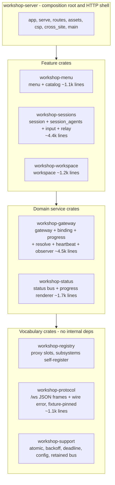
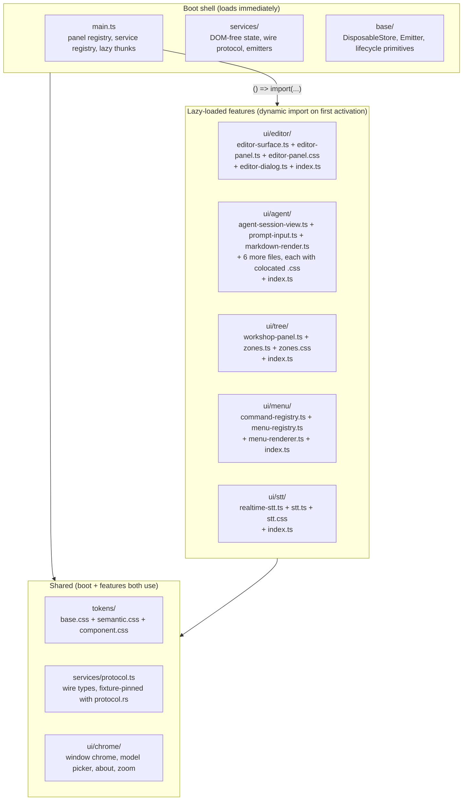

# Workshop Full-Stack Decomposition

<product-contract>

## Product Requirements

Workshop is being positioned as a full IDE competing with Cursor. The server delivers everything to a thin Tauri shell via a WebSocket-driven SPA. The codebase must scale to IDE-level feature surface while remaining navigable by agents (narrow-context crates) and friendly to UI/UX designers (discoverable CSS, design tokens, feature-based directories).

- Problem and users: The server is one 18.2k-line crate with hand-wired subsystems and a god-struct composition root. The SPA is a monolithic bundle (69 files, ~399 KB, everything loads at boot) with no CSS scoping, a flat directory mixing 15 concerns, and a 618-line menu god-object. Agents struggle with the large interaction surface. Designers cannot find or safely edit styles.
- Goals: (1) Decompose the server into one-way layered crates with self-registering subsystems, enforced by Cargo. (2) Decompose the SPA into lazy-loaded feature directories with colocated CSS, design tokens, and pluggable registries. (3) Make every component independently comprehensible within a single context window. (4) Make the CSS layer designer-friendly: discoverable, scopable, theme-swappable.
- Non-goals: No React/Vue/Angular adoption. No Shadow DOM migration (the field is split; `.ws-*` prefix provides 80% of the benefit at 10% of the cost). No LSP integration in this plan. No real extension API yet.
- Success criteria: Every crate under 2k lines. Every file under 500 lines. No hand-wiring in composition roots - subsystems self-register. Initial SPA bundle contains only the shell, services, and chrome; heavy panels load on first activation. All design tokens in `--ws-*` custom properties. Zero raw `#hex` or `px` values in component CSS.
- Constraints: The wire format in `protocol.rs` + `protocol.ts` + their shared JSON fixtures must not change. Public APIs of `promptforge-*` / `shared-*` crates are untouched. The DisposableStore lifecycle tree is correct and stays. The `workshop` Tauri shell stays one thin crate (verified healthy: largest real file 688 lines, slated for deletion).
- Open questions: None

## Functional Specification

The decomposition is purely structural - no user-visible behavior changes. Every panel, menu, shortcut, socket connection, and status update works identically after the restructure. The wire protocol is the invariant.

- Actors and workflows: Agents work on narrow crates instead of one 18k-line crate. UI/UX designers find styles in feature directories beside the TypeScript, edit tokens to theme, and see changes via CSS hot-reload. The build system enforces the one-way graph and file-size ceiling.
- Inputs and outputs: Server inputs/outputs unchanged (HTTP + WebSocket). SPA inputs/outputs unchanged (same wire frames, same DOM). Build output changes from one monolithic `app.js` to a shell chunk plus lazy-loaded feature chunks.
- States and validation: `AppState` decomposes from 9 named fields into registry handles. Module-scope Maps/Sets in `zones.ts` and `workshop-panel.ts` move into observable services. No new states introduced.
- Errors and recovery: Per-crate error types replace the central `error.rs`; the shell maps them to HTTP responses. SPA gains `Result<T, E>` + `ErrorCatalog` replacing stringly-typed errors.
- Security and privacy behavior: No changes. CSP, cross-site guard, and jailed workspace all stay.
- Acceptance criteria: Full Rust test suite green (`cargo test --locked --workspace`). Full SPA tests green (`npm run build` + `node --test`). Visual verification that all five menus, all panels, and all keyboard shortcuts work. Initial bundle size measurably smaller than pre-decomposition.

</product-contract>
<implementation-contract>

## Technical Design

The architecture splits into two parallel decompositions - server-side crates and client-side SPA features - sharing one pattern: subsystems self-register into a central registry owned by a bottom layer, the dependency graph flows strictly one way, and mechanical enforcement (Cargo, xtask tests, lint rules) replaces reviewer vigilance. Evidence base: two what-to-steal reports analyzing 12 reference projects (Zed, VS Code, Theia, rust-analyzer, Helix, ox, JupyterLab, Home Assistant, vanilla-typescript-spa, ft_transcendence) with citation-checked findings and per-idiom provenance tags.

### Server crate graph

Dependencies flow strictly downward. Cargo enforces no upward edges. Crates in the same tier never depend on each other - they meet through `workshop-protocol` (wire types) and `workshop-registry` (proxy slots).



Every crate carries: a written invariant list in its `lib.rs` docs (rust-analyzer's architecture.md pattern, strong human signal, introduced 2018 by Aleksey Kladov), workspace-inherited lints, and files under the 500-line ceiling.

### Workspace manifest discipline (rulebook section 8)

The workspace root stays a virtual manifest (`[workspace]` with no `[package]`). All new crates go in the flat `crates/` directory, globbed as `members = ["crates/*"]`. Each crate is named `workshop-*` in kebab-case with no `-rs` suffix. Every external dependency is declared once in `[workspace.dependencies]`; members write `dep.workspace = true`. Internal path dependencies carry both `path` and `version` in `[workspace.dependencies]`. New crates set `version = "0.0.0"` and `publish = false`. `edition`, `rust-version`, `license`, and `repository` are inherited from `[workspace.package]`. `[profile.*]` and `[patch.*]` stay in the root manifest only.

### Per-crate conventions (rulebook sections 5, 6, 7, 10, 12)

- `lib.rs` is a facade only: crate docs (`//!`), crate-level attributes, `mod` declarations, and `pub use` re-exports. No logic.
- Default every item to `pub(crate)`. Set `unreachable_pub = "warn"` so bare `pub` reliably marks the public API.
- Each crate gets its own concrete error type derived with `thiserror`, `#[non_exhaustive]` on every public error enum and on every variant carrying data. `Display` messages are lowercase noun phrases, no trailing period, no `failed to` prefix. The shell crate maps per-crate errors to HTTP responses - no crate below the shell exposes `anyhow`, `Box<dyn Error>`, or another crate's error type through a public signature.
- Document every `pub` item. `# Errors` on every `Result`-returning function. `# Panics` where callers can trigger one. `# Safety` on every `unsafe` item.
- Lint levels in `[lints]` tables only, never `#![deny(...)]` at the crate root. Each member inherits from `[workspace.lints]` with `[lints] workspace = true`. The workspace already sets `unsafe_code = "forbid"`, `missing_docs = "warn"`, `clippy::unwrap_used = "deny"`, `clippy::expect_used = "deny"`.
- One integration-test binary at `tests/it/main.rs` per crate, not one file per test. Shared test helpers go in `tests/common/mod.rs` (not `tests/common.rs`, which Cargo builds as its own binary). Test-only dependencies in `[dev-dependencies]`. Gate cross-crate test helpers behind a `test-fixtures` feature.

### Server crate map

Tier 0 - vocabulary, no internal dependencies:
- `workshop-protocol` - from `protocol.rs` + `error.rs`. The client-server wire contract: every JSON frame exchanged over the `/ws` socket, plus the opaque wire error. Zero I/O, fixture-pinned. rust-analyzer confines `lsp-types` to exactly 1 of 33 manifests; this applies the same transport-quarantine discipline.
- `workshop-support` - from `atomic.rs`, `backoff.rs`, `deadline.rs`, `config.rs`, plus a new generic retained-bus abstraction collapsing the three hand-rolled copies in status/catalog/menu (~2k lines of duplicated broadcast + retained snapshot + resend-on-reconnect).
- `workshop-registry` - NEW, the keystone. One proxy slot per subsystem (`RwLock<Option<Arc<dyn Trait>>>`); subsystems self-register routes, state handles, and shutdown; unregistered slots are graceful no-ops. The registry's traits are sealed (rulebook section 6: seal a trait you do not want implemented downstream with a private empty supertrait) so only workshop crates can implement them. `#[must_use]` on the registration handle. All six crate-report references converge: Zed's `ExtensionHostProxy`, VS Code's `registerSingleton`, Theia's `ContainerModule`, rust-analyzer's `handlers::all()`, Helix's `register_hook!`, ox's convention tables.

Tier 1 - domain services:
- `workshop-gateway` - ~4.5k lines. HTTP client, endpoint binding, discovery, heartbeat, progress subscriber, relay, test seam. Domain crate never exposes an axum type (Helix quarantines LSP the same way).
- `workshop-status` - ~1.7k lines. Status-bar broadcast bus, progress renderer, event log.
- `workshop-menu` - ~1.1k lines. Model menu snapshot, catalog channel.

Tier 2 - features:
- `workshop-sessions` - ~4.4k lines. `/ws` WebSocket, agent supervision, input waits.
- `workshop-workspace` - ~1.2k lines. Jailed filesystem: trees, reads, writes.

Tier 3 - shell (the slimmed `workshop-server`):
- `app.rs` (composition root over the registry), `routes.rs`, `serve.rs`, `assets.rs`, `csp.rs`, `cross_site.rs`, `push.rs`, `fixtures.rs`, `main.rs`, `lib.rs`.

### SPA structure

Feature-based directories with colocated assets - the universal industry standard for designer-friendly codebases (confirmed by GitHub Primer, Shoelace, Adobe Spectrum, IBM Carbon, and all 6 SPA references). A designer finds "the styles for the agent chat" at `ui/agent/agent-session.css`, not by grepping a flat folder.



### SPA naming and file conventions

- Directories: kebab-case (`ui/agent/`, `tokens/`)
- Files: kebab-case (`agent-session-view.ts`, `agent-session.css`)
- CSS classes: `.ws-` project prefix (`.ws-agent-toolbar`, `.ws-prompt-input`) - namespace isolation matching VS Code and Theia's `.theia-` convention, without Shadow DOM or CSS modules
- Design tokens: `--ws-` prefix (`--ws-color-bg-surface`, `--ws-spacing-panel-gap`) - three-tier architecture following Primer/Spectrum/Carbon: `tokens/base.css` (primitives) -> `tokens/semantic.css` (intent aliases, theming) -> `tokens/component.css` (per-component overrides). All 5 surveyed design systems split tokens by domain; all 5 use separate theme files.
- Barrel exports: each directory has `index.ts`; lazy directories export `register()` installing commands, menu items, panel factories, and socket subscriptions
- CSS colocation: `.css` beside `.ts`, imported as side-effect; esbuild CSS hot-reload gives designers save-and-see workflow

### SPA target layout

| Directory | Files | Lines | Loads | Designer touches |
|---|---|---|---|---|
| `(root)` | 2 | ~220 | boot | - |
| `base/` | 2 | 119 | boot | - |
| `services/` | 12 | 2,786 | boot | - |
| `tokens/` | 3 | ~120 | boot | `base.css` (primitives), `semantic.css` (theme), `component.css` (overrides) |
| `ui/agent/` | ~12 | ~1,720 | lazy | `.css` per component |
| `ui/editor/` | ~4 | ~740 | lazy | `editor-panel.css` |
| `ui/layout/` | ~6 | ~1,250 | lazy | `zones.css` |
| `ui/menu/` | ~6 | ~730 | lazy | per-menu CSS |
| `ui/take/` | ~4 | ~1,100 | lazy | - |
| `ui/stt/` | ~3 | ~400 | lazy | `stt.css` |
| `ui/chrome/` | ~7 | ~780 | boot | 5 `.css` files |
| `ui/status/` | ~1 | ~150 | boot | - |
| `ui/workspace/` | ~2 | ~260 | lazy | - |
| `ui/gateway/` | ~2 | ~140 | lazy | `gateway-config-panel.css` |
| `ui/shared/` | ~1 | ~16 | boot | Icons |

### Registration point inventory (12 total)

Every one follows the same pattern: a central file names things today; after the decomposition, things name themselves.

Server side (5 points, all flow through `workshop-registry`):

| # | What | Central wiring today | Registrant |
|---|---|---|---|
| 1 | Routes | `app.rs:242-255` - 7 `.merge()` calls | Each subsystem crate |
| 2 | State handles | `app.rs:164-204` - `AppState` constructs 9 fields by name | Each subsystem crate |
| 3 | Background tasks | `heartbeat.rs`, `gateway_progress.rs`, `progress.rs` - 3 `tokio::spawn` | Each subsystem crate |
| 4 | Push channels | `push.rs` - cross-bus facade naming 3 buses | Each subsystem crate |
| 5 | Shutdown handles | `serve.rs` - stop senders held by root | Each subsystem crate |

SPA side (7 points):

| # | What | Central wiring today | Registrant |
|---|---|---|---|
| 6 | Panel types | `panel-types.ts:49-81` - 4 hardcoded entries | Each directory's `index.ts` |
| 7 | Menu items | `window-menu.ts:168-195` - 5 hardcoded arrays | Each directory via `appendMenuItem()` |
| 8 | Services | `main.ts:46-81` - 8 services by name | Each service via `registerService(token, factory)` |
| 9 | Socket handlers | `main.ts:84-228` - 4 hand-wired subscriptions | Each directory at activation |
| 10 | Keyboard shortcuts | `shortcuts.ts` - hardcoded table | Each directory, alongside its commands |
| 11 | Zone affinities | `panel-types.ts` - hardcoded `defaultZone` | Part of panel registry (#6) |
| 12 | Lifecycle disposal | `main.ts:28` - 20+ `.add()` calls | Each subsystem's `register()` returns disposable |

### God-object decomposition

**Server `AppState`:** Nine fields already have single owners. Each subsystem crate owns its state behind a narrow handle trait; handlers receive only the handles their route needs (Zed Entity-handles, Helix boxed callbacks, rust-analyzer host/snapshot split). `AppState` shrinks to a registry of handles. `SessionHost` carrying five buses is the specific tangle - the generic retained-bus plus per-route handle injection removes it. The `error.rs <-> app.rs` cycle breaks by moving error-to-HTTP mapping up into the shell, with per-crate error types below (rulebook section 5: prefer one error type per unit of fallibility so a caller never sees variants a function cannot produce; never expose a dependency's error type through a public API; wrap it or hide the representation behind `#[error(transparent)]`).

**SPA `window-menu.ts` (618 lines, 5 HTML menus):** Becomes a pluggable registry: `command-registry.ts` (Map of command descriptors), `menu-registry.ts` (Map of menu placements per MenuId), `menu-renderer.ts` (reads registries, builds DOM, knows nothing about what's registered). VS Code's `MenuRegistry` + `registerAction2` pattern. Each concern directory registers its commands and menu items at activation - lazy panels register when their chunk loads.

**SPA module-scope state:** `zones.ts` and `workshop-panel.ts` hold Maps/Sets at module scope, invisible to services. Move into `ZoneStateService` and `TreeStateService` on the existing Emitter pattern.

- Modules and interfaces: Server splits into 8 crates across 4 tiers. SPA splits into ~14 feature directories. Three SPA registries (panel, menu/command, service) mirror the server's `workshop-registry`. Each lazy directory exports `register()`.
- File and public API changes: `app.rs` shrinks from composition root to registry host. `main.ts` shrinks from 230 lines of hand-wiring to registry setup + lazy thunks. 8 oversized Rust files split during crate extraction. `window-menu.ts` splits into 3 registry files + per-directory registrations.
- Data, persistence, failure, security, and privacy constraints: Wire protocol unchanged. Layout persistence JSON unchanged (dockview serialization). `workshop.toml` config unchanged. CSP, cross-site guard, and jailed workspace unchanged. No new persistence, no new network surface.

### AGENTS.md guard rails

Three structural rules plus two designer-facing rules at `promptforge/AGENTS.md`:

```
# Structural Rules

- Dependencies flow one way: shell -> features -> services -> vocabulary.
  Never add a dependency from a lower tier to a higher one. If Cargo rejects
  a cycle, the design is wrong, not the graph. On the SPA side, lazy-loaded
  panels never import the boot shell; shared code lives in services/ or base/.
- Every workshop-* crate's lib.rs opens with a //! doc listing what the crate
  may depend on and what it may not. Read it before adding an import. Every
  SPA concern directory (ui/editor/, ui/agent/, etc.) has the same in its
  index.ts.
- No file exceeds 500 lines. If an edit would push a file past 500, split
  first, then edit.

# SPA and CSS Rules

- CSS lives beside its TypeScript, never in a separate styles/ tree. A
  designer finds the styles for the agent chat at ui/agent/agent-session.css,
  not by grepping a flat directory. Every feature directory is self-contained:
  .ts, .css, and index.ts together.
- No raw color, size, or spacing values in component CSS. Use --ws-* tokens
  from tokens/. Primitives go in tokens/base.css, intent aliases in
  tokens/semantic.css, per-component overrides in tokens/component.css. A
  designer themes the app by editing semantic.css.
```

</implementation-contract>
<verification-contract>

## Testing Plan

The test suites are the invariant. Every work item passes the full suite before commit. The wire protocol fixtures pin behavior across the restructure.

- Unit: Existing Rust unit tests move with their modules into the new crates (rulebook section 11: unit tests in `#[cfg(test)] mod tests` in the same file). No new unit tests required for file moves; new tests required for the generic retained-bus abstraction, the registry crate, the SPA panel registry, and the command/menu registries.
- Integration and end-to-end: One integration-test binary at `tests/it/main.rs` per crate, with `mod` per area (rulebook section 11: each extra file directly under `tests/` relinks the whole library). Existing integration tests continue to test the composed server. SPA visual verification confirms all five menus, all panels, and all keyboard shortcuts work after each structural change. The headless feature flag enables new end-to-end tests without the webview.
- Regression, security, and performance: The full local loop before pushing (rulebook section 12): `cargo fmt --all --check`, `cargo clippy --all-targets --all-features -- -D warnings`, `cargo test --locked --workspace --all-features`, `cargo test --doc`, `RUSTDOCFLAGS="-D warnings" cargo doc --no-deps --all-features`. `protocol.rs`/`protocol.ts` cross-language fixture tests catch wire-format drift. `npm run build` on every SPA step. Initial bundle size measured before and after lazy-loading to confirm reduction.
- Exit criteria: All crates under 2k lines. All files under 500 lines. No hand-wiring in composition roots. Initial SPA bundle measurably smaller. `xtask` architecture tests pass (allowed-dependency tables, file ceiling). CSS lint blocks raw values. Full CI green. `cargo hack check --feature-powerset --no-dev-deps --depth 2` confirms every feature combination compiles.

</verification-contract>
<decision-record>

## Decision Record

- Decisions:
  - Self-registration via proxy slots, not DI framework: Zed's `ExtensionHostProxy` pattern (one `RwLock<Option<Arc<dyn Trait>>>` per subsystem) is the most portable Rust form. "I want a central server that has an API that lets the sub-crates install themselves, so we don't have a cyclic dependency."
  - Feature-based SPA directories, not layer-based: "I want to make it very easy for [UI/UX designers] to work on this shit." Industry consensus (Primer, Spectrum, Carbon, all 6 SPA references) confirms feature-based. A designer browses `ui/agent/` to find agent styles.
  - Three-tier design tokens (base/semantic/component): Primer, Spectrum, and Carbon all use this. Semantic tier is where theming happens. Lint rule blocks raw values in component CSS.
  - `.ws-*` CSS prefix over Shadow DOM: "The field is split (Home Assistant and vanilla-typescript-spa use Shadow DOM; VS Code and Theia do not). The `.ws-*` prefix provides 80% of the benefit at 10% of the cost."
  - Pluggable menu registry over hardcoded arrays: VS Code's `MenuRegistry` + `registerAction2` pattern. "A component can install menus dynamically." Lazy panels register their items when their chunk loads.
  - Crate decomposition for agentic workflows, not just build parallelism: "A larger crate has a bigger interaction surface with itself. A smaller crate is more focused, and the crate is the natural unit of context."
  - Server crate graph as a strict tree: "The dependency graph has to go only one way. It has to be a tree, and it has to be clean, and I want it enforced by cargo."
  - Mechanical enforcement (xtask tests) over review: "3 of 6 crate-report references enforce mechanically; the one that doesn't - Zed - has the biggest god-files."
- Rejected alternatives:
  - Shadow DOM for CSS isolation: Duplicates CSS across shadow roots. Home Assistant uses it successfully but VS Code and Theia do not. Revisit if `.ws-*` prefix proves insufficient.
  - Full DI framework (InversifyJS) on the SPA side: Too heavy for the subject's vanilla-TS discipline. Lightweight registries (Map + factory) achieve the same decoupling.
  - Publishing crates to crates.io: "I don't give a shit." All crates are `publish = false`.
  - Phased contribution lifecycle now: Premature before the registry exists and subsystem count justifies it.
  - HTML template files now: Low priority because DOM construction is clean enough and the primary designer touchpoint is CSS.
- Assumptions, risks, and notes:
  - The `workshop` Tauri shell is verified healthy at ~3.5k lines with the largest real file at 688 lines (slated for deletion). It stays one crate.
  - `AppState`'s nine fields already have single owners, so the god-struct decomposition is latent - the crate split formalizes ownership that already exists.
  - esbuild supports `import()` splitting natively with `splitting: true` and `format: 'esm'`.
  - The `workshop` crate overrides `unsafe_code` from `forbid` to `deny` because `bridge.rs` uses raw WebView2 COM and cannot be written without unsafe; this is documented in the crate's `Cargo.toml`.
  - Risk: if the per-concern state split turns out artificial, a `workshop-common` crate could recreate the big interaction surface one level down. The registry's proxy-slot design mitigates this - subsystems meet through protocol types, not shared state.
  - CI is currently red: `promptforge-core` scheduler determinism-violation test broken by the drain commit (`f566cc1`). Must be fixed before any decomposition work.

</decision-record>
<project-survey>

## Project Survey

- Status: complete
- Build command: `cargo build --locked -p gateway` (default member; workshop: `cargo build --locked -p workshop`)
- Focused test command pattern: `cargo nextest run --locked -p <crate> <test_name>`
- Component test command pattern: `cargo nextest run --locked -p <crate>`
- Full-suite test command: `cargo nextest run --locked --workspace --exclude workshop --exclude workshop-server --all-features` (workshop: `cargo nextest run --locked -p workshop -p workshop-server`)
- Linter command: `cargo clippy --workspace --exclude workshop --exclude workshop-server --all-targets --all-features -- -D warnings` (workshop: `cargo clippy -p workshop -p workshop-server --all-targets -- -D warnings`)
- Formatter check command: `cargo fmt --all --check`
- Docs command: `RUSTDOCFLAGS="-D warnings" cargo doc --workspace --no-deps --all-features --exclude workshop --exclude workshop-server`
- Test placement and naming conventions: one integration-test binary at `tests/it/main.rs` per crate with `mod` per area and subdirectories for sub-modules; shared test helpers in `tests/common/mod.rs`; unit tests in `#[cfg(test)] mod tests` in-file; SPA tests via `node --test "test/**/*.mjs" "src/**/*.test.mjs"` from `crates/workshop-server/ui`
- Directory map:
  - `crates/` - flat directory of all Rust crates (37 crates) and one non-Rust package (`shared-ui`); workspace globbed as `members = ["crates/*"]` with `shared-ui` excluded
  - `crates/workshop-server/` - the 18.2k-line server crate being decomposed; `src/` has 40+ Rust source files; `ui/` holds the SPA (TypeScript + CSS, esbuild-bundled)
  - `crates/workshop-server/ui/src/` - SPA entry: `main.ts`, `base/` (lifecycle primitives), `services/` (DOM-free state), `ui/` (flat 23 TS + 13 CSS), `ui/workshop/` (flat 13 TS + 4 CSS)
  - `crates/workshop/` - Tauri desktop shell (thin, verified healthy)
  - `crates/gateway*/` - inference gateway product crates (gateway, gateway-config, gateway-config-ui, gateway-local, gateway-logging, gateway-protocol, gateway-routing, gateway-stt, gateway-stt-backend-whisper, gateway-stt-engine, gateway-web-search, gateway-whisper-ffi)
  - `crates/promptforge*/` - runtime engine crates (promptforge, promptforge-core, promptforge-core-support, promptforge-agent, promptforge-lua, promptforge-model-client, promptforge-parser, promptforge-store, promptforge-tool-picker, promptforge-tools, promptforge-vfs, promptforge-webfetch, promptforge-web-search)
  - `crates/shared-*/` - cross-product crates (shared-loopback, shared-progress, shared-sidecar, shared-vfs, shared-ui)
  - `crates/build-*/` - build output crates (build-llama-cuda, build-ui, build-user-guide, build-workshop)
  - `crates/product-integration-tests/` - cross-product integration tests
  - `.github/workflows/` - CI: fmt, clippy, test (nextest), docs, check-workshop (Windows), check-workshop-linux, ui (typecheck + build + test), supply-chain (cargo-deny + cargo-audit), ci-green gate
  - `guide/` - user guide sources
  - `prompts/` - prompt pipeline sources
  - `tools/` - build and staging scripts (e.g. `stage-gateway-sidecar.mjs`)
  - `vibe/` - project context (`archdoc.md`)
- Component boundaries:
  - Workshop crates (`workshop-*`) depend on shared crates but not on gateway or promptforge crates
  - Gateway crates (`gateway-*`) depend on shared crates but not on promptforge or workshop crates
  - PromptForge crates (`promptforge-*`) depend on shared crates but not on gateway or workshop crates
  - Shared crates (`shared-*`) depend on no product crates
  - Default `cargo build` builds only gateway; workshop requires explicit `-p workshop`
  - Workshop-server and workshop are excluded from the Linux CI clippy/test/docs jobs and tested separately on Windows (and a dedicated Linux job)
  - SPA is TypeScript (esbuild-bundled, Node >= 22), no framework (vanilla TS); depends on `shared-ui` as a local npm file dependency
- Conventions summary:
  - Rust 2024 edition, stable toolchain, `rustfmt.toml` with `style_edition = "2024"`
  - Workspace-inherited lints: `unsafe_code = "forbid"`, `missing_docs = "warn"`, `clippy::unwrap_used = "deny"`, `clippy::expect_used = "deny"`, `clippy::all = "deny"`, `clippy::pedantic = "warn"`; `clippy.toml` allows unwrap/expect in tests
  - All external dependencies declared once in `[workspace.dependencies]`; members use `dep.workspace = true`
  - Internal path dependencies carry both `path` and `version` in `[workspace.dependencies]`
  - `cargo-deny` and `cargo-audit` for supply-chain checks
  - `cargo-nextest` for concurrent test execution in CI
  - SPA: `npm run build` (esbuild), `npm run typecheck` (tsc --noEmit), `npm test` (node --test)
  - CI gate job (`ci-green`) aggregates all jobs for branch protection

</project-survey>
<execution-plan>

## Execution Instructions

<step-1>

### Step 1: Fix CI [completed]

- Component: Foundation

Fix the scheduler determinism-violation test in `promptforge-core` (`scheduler.rs:2543`). The drain commit (`f566cc1`) lets both concurrent appends complete before the conflict detector fires. [Failing run](https://github.com/cppalliance/promptforge/actions/runs/34707753972). The fix must make the conflict detector fire deterministically regardless of append ordering during drain. CI must be fully green before any decomposition work begins.

Verification: `cargo nextest run --locked -p promptforge-core scheduler` passes locally. Push and confirm CI green on all jobs.

</step-1>

<step-2>

### Step 2: AGENTS.md, xtask, and new-crate generator [completed]

- Component: Foundation

Add `promptforge/AGENTS.md` with three structural rules (one-way deps: shell -> features -> services -> vocabulary; per-crate invariant docs in `lib.rs`; 500-line file ceiling) and two designer-facing rules (CSS colocation beside TypeScript; token-only `--ws-*` values in component CSS).

Add `crates/xtask/` with tidy-style `#[test]` architecture checks: allowed-dependency table per tier (vocabulary crates depend on no internal crates; service crates depend only on vocabulary; feature crates depend on vocabulary and services; shell depends on all), forbidden reverse edges, file-line ceiling scan (500 lines), `unreachable_pub` enforcement. Add a `new-crate` subcommand that scaffolds `crates/workshop-<name>/` with `Cargo.toml` (workspace-inherited edition/lints/version, `publish = false`), facade `lib.rs` with `//!` invariant docs, and `tests/it/main.rs`. rust-analyzer's tidy checks (Kladov 2019) and Zed's `script/new-crate` are the reference patterns.

Verification: `cargo test -p xtask` passes. `cargo xtask new-crate workshop-scratch` scaffolds correctly (then delete it). AGENTS.md renders correctly.

</step-2>

<step-3>

### Step 3: Extract tier-0 vocabulary crates

- Component: Server Decomposition

Extract all three vocabulary crates in leaf-first order. These crates have no internal dependencies.

**workshop-protocol:** Extract from `workshop-server/src/protocol.rs` and `workshop-server/src/error.rs` (wire error variants only). The client-server wire contract: every JSON frame exchanged over `/ws`, plus the opaque wire error type. Zero I/O, fixture-pinned against `protocol.ts` and shared JSON fixtures. Declare in `[workspace.dependencies]` with `path` and `version`.

**workshop-support:** Extract from `workshop-server/src/atomic.rs`, `workshop-server/src/backoff.rs`, `workshop-server/src/deadline.rs`, `workshop-server/src/config.rs`. Add a new generic retained-bus abstraction (`RetainedBus<T>`) collapsing the three hand-rolled copies in status/catalog/menu (broadcast + retained snapshot + resend-on-reconnect, ~2k duplicated lines). Each copy becomes a type alias or thin wrapper over the generic bus.

**workshop-registry:** NEW crate - the keystone. One proxy slot per subsystem (`RwLock<Option<Arc<dyn Trait>>>`); sealed traits (private empty supertrait) so only workshop crates can implement them. Traits for: route registration, state handle provision, background task spawning, push channel subscription, shutdown handle. `#[must_use]` on the registration guard handle. Unregistered slots are graceful no-ops. Migrate status bus as the proof-of-concept registrant.

Update `workshop-server/Cargo.toml` to depend on all three. Update `xtask` allowed-dependency tables.

Verification: `cargo clippy -p workshop-protocol -p workshop-support -p workshop-registry --all-targets -- -D warnings` clean. `cargo test --locked --workspace` green. Wire protocol fixture tests still pass. `cargo test -p xtask` confirms dependency graph.

</step-3>

<step-4>

### Step 4: Extract service crates

- Component: Server Decomposition

Extract all three domain service crates. These depend only on tier-0 vocabulary crates.

**workshop-gateway** (~4.5k lines): Extract from `workshop-server/src/gateway.rs`, `workshop-server/src/gateway_binding.rs`, `workshop-server/src/gateway_progress.rs`, `workshop-server/src/resolve.rs`, `workshop-server/src/heartbeat.rs`, `workshop-server/src/observer.rs`. HTTP client, endpoint binding, discovery, heartbeat, progress subscriber, relay, test seam. Domain crate never exposes an axum type in its public API. Self-registers routes, state handle, and background tasks (heartbeat, progress) into `workshop-registry`.

**workshop-status** (~1.7k lines): Extract from `workshop-server/src/status.rs`, `workshop-server/src/progress.rs`. Status-bar broadcast bus (now backed by generic `RetainedBus<StatusEvent>`), progress renderer, event log. Self-registers push channel and state handle.

**workshop-menu** (~1.1k lines): Extract from `workshop-server/src/menu.rs`, `workshop-server/src/catalog.rs`. Model menu snapshot, catalog channel (backed by `RetainedBus<CatalogEvent>`). Self-registers push channel and state handle.

Each crate gets its own concrete error type derived with `thiserror`, `#[non_exhaustive]`. Update `workshop-server` to depend on all three service crates. Update `xtask` allowed-dependency tables.

Verification: `cargo clippy --all-targets --all-features -- -D warnings` clean for all new crates. `cargo test --locked --workspace` green. `cargo test -p xtask` confirms no upward dependency edges.

</step-4>

<step-5>

### Step 5: Extract feature crates and decompose AppState

- Component: Server Decomposition

Extract both feature crates. These depend on vocabulary and service crates.

**workshop-workspace** (~1.2k lines): Extract from `workshop-server/src/workspace.rs`. Jailed filesystem: tree operations, reads, writes. Self-registers routes and state handle.

**workshop-sessions** (~4.4k lines): Extract from `workshop-server/src/session.rs`, `workshop-server/src/session_agents.rs`, `workshop-server/src/input.rs`, `workshop-server/src/relay.rs`. WebSocket `/ws` handler, agent supervision, input waits. Self-registers routes, state handle, push channels, and background tasks. The `SessionHost` tangle (five buses) resolves through generic `RetainedBus` plus per-route handle injection via registry traits.

**AppState decomposition:** `AppState` in `app.rs` shrinks from 9 named fields to registry handles. Each extracted subsystem owns its state behind a narrow handle trait registered in `workshop-registry`. The shell's `app.rs` becomes a composition root that starts the registry, calls each crate's `register()`, and builds the axum router from registered routes. `error.rs` error-to-HTTP mapping stays in the shell; per-crate error types live below.

Update `xtask` allowed-dependency tables for the complete tier graph.

Verification: `cargo clippy --all-targets --all-features -- -D warnings` clean workspace-wide. `cargo test --locked --workspace` green. All crates under 2k lines. `cargo test -p xtask` confirms the full one-way dependency graph. No file exceeds 500 lines.

</step-5>

<step-6>

### Step 6: SPA directory split, CSS colocation, and design tokens

- Component: SPA Restructuring

**Directory split:** Move 53 files from flat `ui/` and `ui/workshop/` into feature directories: `ui/agent/` (12 files), `ui/editor/` (4 files), `ui/layout/` (6 files from `workshop/`), `ui/menu/` (2 files), `ui/stt/` (3 files), `ui/chrome/` (7 files), `ui/take/` (4 files), `ui/status/` (1 file), `ui/workspace/` (1 file), `ui/gateway/` (2 files + 2 CSS), `ui/shared/` (1 file). Add barrel `index.ts` per directory re-exporting the directory's public API. Update all import paths in `main.ts`, `services/`, and cross-directory references. File mapping follows the SPA file inventory table in the plan.

**CSS colocation:** Each `.css` file moves beside its `.ts` counterpart (already the case in the flat directories; the directory split preserves this). Rename all CSS classes to `.ws-*` prefix (`.ws-agent-toolbar`, `.ws-prompt-input`, `.ws-editor-panel`, etc.). Update all `querySelector`/`classList` references in TypeScript. CSS imports remain side-effect imports.

**Design token extraction:** Extract raw color, spacing, font, and size values from all 17 CSS files into three token files: `tokens/base.css` (primitives: raw hex colors, px sizes, font stacks), `tokens/semantic.css` (intent aliases: `--ws-color-bg-surface`, `--ws-spacing-panel-gap`, mapped to base tokens, theming layer), `tokens/component.css` (per-component overrides). Replace all raw values in component CSS with `var(--ws-*)` references. Zero raw `#hex` or `px` values remain in component CSS after this step.

Verification: `npm run build` succeeds. `npm run typecheck` clean. `npm test` (`node --test`) green. Visual verification that all five menus, all panels, and all keyboard shortcuts work. No raw color/size/spacing values in component CSS (grep confirms).

</step-6>

<step-7>

### Step 7: SPA registries, lazy loading, and god-object breakup

- Component: SPA Restructuring

**Panel registry and lazy loading:** Add `services/panel-registry.ts` mapping panel IDs to `() => import(...)` thunks. Enable esbuild `splitting: true` and `format: 'esm'` in the build config. Each feature directory's `index.ts` exports a `register()` function that installs its panel factory, commands, menu items, socket subscriptions, and keyboard shortcuts. `main.ts` shrinks from 230 lines of hand-wiring to registry setup + lazy thunks. Initial bundle contains only shell, services, and chrome; heavy panels (`ui/agent/`, `ui/editor/`, `ui/layout/`, `ui/take/`) load on first activation. Home Assistant's `partial-panel-resolver` is the reference pattern.

**Pluggable menu system:** Split `window-menu.ts` (618 lines) into three files in `ui/menu/`: `command-registry.ts` (Map of command descriptors keyed by command ID), `menu-registry.ts` (Map of menu placements per MenuId, `appendMenuItem()` API), `menu-renderer.ts` (reads both registries, builds DOM, knows nothing about what's registered). Each feature directory registers its commands and menu items in its `register()` function. VS Code `MenuRegistry` + `registerAction2` pattern.

**Part base class:** Add `base/workshop-part.ts` with `WorkshopPart` abstract class: `create(parent: HTMLElement)`, `layout(dimension: IDimension)`, `dispose()`. All panels extend `WorkshopPart`. VS Code Part/Composite hierarchy reference.

**Service and event registries:** Add `services/service-registry.ts` with `registerService(token, factory)` for lazy instantiation. Socket handler registration per directory at activation. Shortcut registration per directory alongside its commands. Each directory's `register()` function is the single entry point for all registration.

**Centralize module-scope state:** Move `zones.ts` module-scope Maps/Sets into `services/zone-state-service.ts` (`ZoneStateService` on the Emitter pattern). Move `workshop-panel.ts` module-scope state into `services/tree-state-service.ts` (`TreeStateService`). Both registered via the service registry.

**Lifecycle disposal:** Each directory's `register()` returns a `Disposable`. `main.ts` collects these into the root `DisposableStore`. Each `register()` internally disposes its own socket subscriptions, event listeners, and service state.

Verification: `npm run build` succeeds with chunk splitting (verify multiple output chunks). `npm run typecheck` clean. `npm test` green. Visual verification of all five menus, all panels, all shortcuts. Measure initial bundle size - must be smaller than pre-split. `window-menu.ts` no longer exists as a single file.

</step-7>

<step-8>

### Step 8: SPA error handling, view decoupling, and asset hashing

- Component: SPA Restructuring

**Typed SPA errors:** Add `services/error-catalog.ts` with `Result<T, E>` type and `ErrorCatalog` enum. Replace stringly-typed error handling across services and UI code with typed error variants. ft_transcendence pattern reference.

**View decoupling:** Define a narrow asset-serving interface in the server (`AssetServer` trait) that the shell implements. Add a `headless` Cargo feature on `workshop-server` that replaces the webview asset layer with a no-op implementation, enabling server-only integration tests without the Tauri webview. Helix TestBackend pattern reference.

**Content-hashed filenames:** Configure esbuild `entryNames: '[name]-[hash]'` and `chunkNames: '[name]-[hash]'`. Generate a manifest JSON mapping logical names to hashed filenames. Update the server's asset-serving to read the manifest and serve correct paths. Add long-lived cache headers (`Cache-Control: immutable`) for hashed assets.

Verification: `npm run build` produces hashed filenames and a manifest. `cargo test --locked --workspace` green (including headless feature tests). `npm test` green. Visual verification all assets load correctly. Server correctly resolves hashed filenames from manifest.

</step-8>

<step-9>

### Step 9: Shell cleanup and rulebook

- Component: Cleanup

**Shell gateway supervisor deletion:** Delete `workshop/src/gateway/supervisor.rs` (~1.4k lines) in the Tauri shell crate. Replace with the existing `shared-sidecar` crate's supervisor, which provides the same gateway lifecycle management. Update `workshop/Cargo.toml` to depend on `shared-sidecar`. Update call sites in the shell to use the shared implementation.

**Rulebook and workspace rules:** Update `.cursor/rules/` with architecture invariants: one-way dependency graph (shell -> features -> services -> vocabulary), registry pattern (self-registration via `workshop-registry`), file ceiling (500 lines), SPA conventions (feature directories, barrel exports, lazy loading), CSS colocation (`.css` beside `.ts`), token-only values (`--ws-*` in component CSS). These rules encode the decomposition's structural decisions so future agents maintain them.

Verification: `cargo clippy -p workshop --all-targets -- -D warnings` clean. `cargo test --locked -p workshop` green. `cargo test -p xtask` confirms full architecture. All crates under 2k lines. All files under 500 lines. Full CI green. `npm run build` + `npm test` green. Initial SPA bundle measurably smaller than pre-decomposition baseline.

</step-9>

### Dependencies and Verification

- Step 1 (Fix CI) must complete before all other steps.
- Step 2 (AGENTS.md + xtask) must complete before Steps 3-5 (server crate extraction).
- Step 3 (tier-0 crates) before Step 4 (services); Step 4 before Step 5 (features). Leaf-first.
- Step 6 (SPA directory split) can begin after Step 2, in parallel with server work.
- Step 7 (SPA registries) requires Step 6 (directories must exist to register into).
- Step 8 (SPA hardening) requires Step 7.
- Step 9 (cleanup) is final.
- Every Rust step verifies with: `cargo fmt --all --check`, `cargo clippy --all-targets --all-features -- -D warnings`, `cargo test --locked --workspace`.
- Every SPA step verifies with: `npm run build`, `npm run typecheck`, `npm test`, visual check.
- Stop condition: two consecutive failures on one step stops the run for a re-plan.

### Deferred and Out of Scope

- Phased contribution lifecycle (VS Code `WorkbenchPhase`, JupyterLab activation phases) - only once subsystem count justifies it.
- Versioned extension API (Zed's immutable WIT snapshots) - only when a real extension API ships.
- Shadow DOM / Web Components - `.ws-*` prefix sufficient; Shadow DOM duplicates CSS across roots.
- HTML template files (Vite `?raw` imports) - CSS is the primary designer touchpoint, not HTML.
- LSP integration - out of scope for this plan.

### SPA file inventory

One HTML file (`index.html`, 50 lines) - a bare shell. All DOM is TypeScript.

Current `ui/` flat directory (23 TS + 13 CSS = 5,411 lines):

| File | Lines | Target |
|---|---|---|
| `ui/window-menu.ts` | 618 | `ui/menu/` - split into 3 registries |
| `ui/window-menu.css` | 111 | `ui/menu/` |
| `ui/take-registry.ts` | 327 | `ui/take/` |
| `ui/take-registry-types.ts` | 163 | `ui/take/` |
| `ui/take-registry-state.ts` | 202 | `ui/take/` |
| `ui/take-registry-events.ts` | 414 | `ui/take/` |
| `ui/agent-session-view.ts` | 334 | `ui/agent/` |
| `ui/agent-session.css` | 258 | `ui/agent/` |
| `ui/agent-menu.ts` | 94 | `ui/agent/` |
| `ui/agent-toolbar.ts` | 32 | `ui/agent/` |
| `ui/agent-toolbar.css` | 11 | `ui/agent/` |
| `ui/prompt-input.ts` | 285 | `ui/agent/` |
| `ui/prompt-input.css` | 91 | `ui/agent/` |
| `ui/markdown-render.ts` | 196 | `ui/agent/` |
| `ui/markdown-render.css` | 122 | `ui/agent/` |
| `ui/tool-call-card.ts` | 133 | `ui/agent/` |
| `ui/tool-call-card.css` | 145 | `ui/agent/` |
| `ui/mode-chip.ts` | 122 | `ui/agent/` |
| `ui/mode-chip.css` | 37 | `ui/agent/` |
| `ui/realtime-stt.ts` | 284 | `ui/stt/` |
| `ui/stt.ts` | 90 | `ui/stt/` |
| `ui/stt.css` | 29 | `ui/stt/` |
| `ui/status-bar.ts` | 151 | `ui/status/` |
| `ui/window-chrome.ts` | 132 | `ui/chrome/` |
| `ui/window-chrome.css` | 86 | `ui/chrome/` |
| `ui/model-picker-trigger.ts` | 83 | `ui/chrome/` |
| `ui/model-picker-trigger.css` | 44 | `ui/chrome/` |
| `ui/token-ring.ts` | 79 | `ui/chrome/` |
| `ui/token-ring.css` | 23 | `ui/chrome/` |
| `ui/about-dialog.ts` | 136 | `ui/chrome/` |
| `ui/about-dialog.css` | 40 | `ui/chrome/` |
| `ui/update-view.ts` | 130 | `ui/chrome/` |
| `ui/update-view.css` | 76 | `ui/chrome/` |
| `ui/zoom.ts` | 69 | `ui/chrome/` |
| `ui/workspace-drops.ts` | 161 | `ui/workspace/` |
| `ui/gateway-config-bridge.ts` | 103 | `ui/gateway/` |

Current `ui/workshop/` flat directory (13 TS + 4 CSS = 2,426 lines):

| File | Lines | Target |
|---|---|---|
| `workshop/workshop-panel.ts` | 332 | `ui/layout/` |
| `workshop/panel-types.ts` | 184 | `ui/layout/` |
| `workshop/layout-persistence.ts` | 136 | `ui/layout/` |
| `workshop/zones.ts` | 219 | `ui/layout/` |
| `workshop/zones.css` | 240 | `ui/layout/` |
| `workshop/shortcuts.ts` | 140 | `ui/layout/` |
| `workshop/editor-surface.ts` | 327 | `ui/editor/` |
| `workshop/editor-panel.ts` | 255 | `ui/editor/` |
| `workshop/editor-panel.css` | 107 | `ui/editor/` |
| `workshop/editor-dialog.ts` | 52 | `ui/editor/` |
| `workshop/agent-panel.ts` | 48 | `ui/agent/` |
| `workshop/typeahead-popup.ts` | 174 | `ui/agent/` |
| `workshop/typeahead-popup.css` | 45 | `ui/agent/` |
| `workshop/mention-chip.ts` | 99 | `ui/agent/` |
| `workshop/icons.ts` | 16 | `ui/shared/` |
| `workshop/gateway-config-panel.ts` | 37 | `ui/gateway/` |
| `workshop/gateway-config-panel.css` | 15 | `ui/gateway/` |

</execution-plan>
