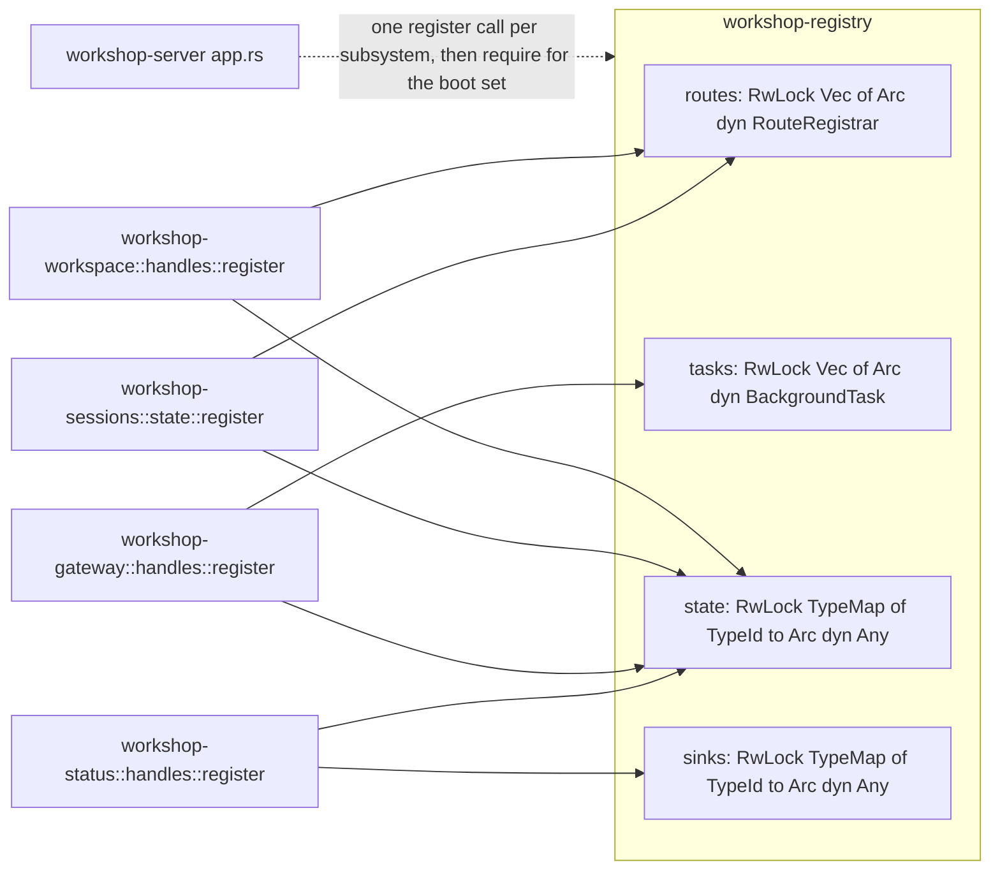

# Workshop Decomposition Debt Removal

<product-contract>

## Product Requirements

The workshop decomposition (13 commits, f566cc1e..310804cc, PR #36) left seven accepted debts, all upheld by an independent challenge pass. The load-bearing one: the registry that was supposed to let subsystems install themselves instead grew a slot named after each subsystem inside the tier-0 crate every crate depends on, while the shell kept wiring every handle by name anyway. The IDE roadmap (explorer, search, source control, browser, terminals, Lua debugger, problems, output, debug console, command palette) puts 15-20 subsystems on this registry; the per-subsystem slot model does not survive that, and the operator confirmed the redesign direction on 2026-09-12.

- Problem and users:
  - `crates/workshop-registry/src/registry.rs` at 310804cc holds fifteen `ProxySlot` fields named per subsystem (`session_routes`, `status_state`, `menu_sink`, ...). Adding a subsystem edits the tier-0 crate: a field, `new()`, an accessor, the manual `Clone` and `Debug` impls. Four generic slots (`routes`, `state_handles`, `tasks`, `shutdown`) have no registrant; `BackgroundTasks` and `ShutdownHook` are sealed with no adapter, so no crate can implement them; `crates/workshop-server/src/serve.rs` spawns and stops heartbeat, renderer, and subscriber by name. (DEBT-WSD-01)
  - `crates/workshop-server/src/app.rs::state_with_gateway` builds every bus and handle by name, passes them into `SessionHost::new` and `SessionsState::new`, and also registers them into slots; `crates/workshop-sessions/src/state.rs` stores `catalog`, `menu`, `gateway`, `health` and `registry` side by side; `session.rs::run_session` reads status through the registry and catalog/menu through typed fields; `AppState::registered<T>()` downcasts `Arc<dyn Any>` per call and panics on a missing slot while the registry documents an empty slot as a graceful no-op. (DEBT-WSD-02)
  - `crates/xtask/src/tidy.rs` binds the 500-line ceiling and lint checks only to crates carrying the `//! ## Invariants` marker; `workshop-server` and `workshop` lack it while the rule glob `crates/workshop*/**` covers both; `crates/workshop-server/tests/it/agents.rs` is 958 lines and the check passes. (DEBT-WSD-03)
  - `crates/workshop-menu/src/lib.rs` (`MenuHandles` plus `register`), `workshop-status/src/lib.rs`, and `workshop-workspace/src/lib.rs` hold registration logic; the rule says `lib.rs` is a facade only; `workshop-gateway/src/handles.rs` shows the intended shape. (DEBT-WSD-04)
  - `crates/build-ui/src/lib.rs` and `crates/workshop-server/ui/build.mjs` both implement splitting, `bundle/app-[hash]`, `chunks/[name]-[hash]`, manifest emission, and index stamping, and document each other as mirrors; the Rust path ships and the Node path serves `npm run watch` and the jsdom suite; nothing fails when they drift. (DEBT-WSD-05)
  - `crates/workshop-server/ui/src/main.ts` re-imports the ten stylesheets of the lazily loaded directories on the premise that a lazy chunk's CSS is otherwise missing. That premise is unverified and likely inverted: esbuild's documented and maintainer-confirmed behavior is to hoist all reachable CSS, including through dynamic imports, into the entry's sibling CSS file (esbuild issue 1590, "by design"); the documented failure modes are CSS duplication across chunk files and missing CSS in multi-entry setups, neither of which applies to this single-entry app. (DEBT-WSD-06, premise under empirical test in step 4)
  - `crates/promptforge-core/src/input.rs:19` links `[Observer]` after the import that resolved it was removed in 4afa3c82; the CI docs job fails with exit 101 (runs 34728011104 and 34728674340). (DEBT-WSD-07)
  - `vibe/2026-09-12-3-workshop-server-decomposition.md` closed with "No hand-wiring in composition roots", "All crates under 2k lines", "No file exceeds 500 lines", and "CSS lint blocks raw values" marked met, and lines 132 and 404 specify "One proxy slot per subsystem", contradicting its own registration inventory (five kinds, each registered by every subsystem crate) and the operator's quoted intent. (DEBT-WSD-08)
- Goals:
  - `workshop-registry` never changes when a subsystem is added.
  - Exactly one wiring path from subsystem to consumer.
  - Every stated structural rule is either enforced or reworded to what is enforced.
  - Drift between the two build implementers fails a test; the lazy-CSS premise is settled empirically and, if the list proves redundant, the entry bundle is covered by a build-output test.
  - CI green on the branch head.
  - The decomposition plan, AGENTS.md, rule files, and registry crate docs describe the tree as it is.
- Non-goals:
  - No new subsystems.
  - No SPA per-directory menu ownership (operator decision 2026-09-12: leave until stressed).
  - No `GatewaySupervisor` port (defers to the headless agent mode plan so the second consumer shapes the API).
  - No phased contribution lifecycle; the redesign must not preclude it.
  - No wire-format, `promptforge-*`, or `shared-*` public API change.
  - No splitting of pre-existing oversized SPA test files; no typed-error expansion beyond the workspace API.
- Success criteria:
  - `git grep -n 'session_routes\|workspace_routes\|status_state\|menu_state\|gateway_state\|sessions_state' -- crates/workshop-registry` is empty.
  - `SessionsState` holds no typed bus fields beside the registry; `serve.rs` spawns and stops no task by name.
  - `cargo test -p xtask` covers `workshop-server`; `RUSTDOCFLAGS="-D warnings" cargo doc --workspace --no-deps --all-features --exclude workshop --exclude workshop-server` exits 0.
  - The build drift test fails on a deliberate one-side change and passes on the tree; if the lazy-CSS empirical check takes branch A, the entry-bundle test covers the entry CSS.
  - `vibe/2026-09-12-3-workshop-server-decomposition.md` carries dated corrections for the registry sentences and the unmet criteria.
- Constraints:
  - Tier rules in `AGENTS.md` and `.cursor/rules/workshop-architecture.mdc` hold: shell -> features -> services -> vocabulary, no same-tier edges.
  - Every file under 500 lines; sealed registry traits stay sealed with closure adapters.
  - Wire protocol, layout persistence, `workshop.toml`, CSP, cross-site guard, and the jail are unchanged.
- Open questions:
  - None. The registry direction was resolved by the operator on 2026-09-12.

## Functional Specification

Purely structural. No user-visible behavior changes except one new startup failure mode: a missing required contribution fails boot with a typed error naming it, instead of a later panic in a request handler.

- Actors and workflows:
  - Agents work in narrow crates; adding a subsystem touches its own crate plus one `register` call in `app.rs`.
  - The shell composes the app by calling each crate's `register` once, then asserting its required handle set at boot.
- Inputs and outputs:
  - Unchanged: HTTP + WebSocket, same wire frames, same DOM, same build outputs.
- States and validation:
  - State handles resolve through `registry.state::<T>() -> Option<Arc<T>>`; an absent handle is the documented degrade at runtime and a boot error only for the shell's required set.
- Errors and recovery:
  - Boot failure names the missing contribution type; runtime reads of absent optional contributions stay graceful no-ops.
- Security and privacy behavior:
  - No change.
- Acceptance criteria:
  - Every grep in Success criteria returns as stated.
  - The workshop test sets, both clippy sets, `cargo fmt --all --check`, the docs command, and the SPA build, typecheck, and tests are green.
  - A release build passes a visual check: five menus, all panels, shortcuts, and a five-turn agent chat.

</product-contract>
<implementation-contract>

## Technical Design

The registry keeps its tier-0 position, sealed traits, and adapter pattern, and replaces the fifteen per-subsystem `ProxySlot` fields with four contribution collections: routes and tasks as ordered vectors of trait objects, state handles and push sinks as maps keyed by `TypeId`. The single downcast lives inside the registry; callers see typed `Option`s. The shell stops passing buses into constructors; subsystems register typed handle sets and consumers read them by type. Everything else is local: three `lib.rs` facades cleaned to match the gateway's shape, the server shell opted into the tidy checks, one test file split, one `--out` flag on the Node build script, a build drift test plus an empirical settling of the lazy-CSS premise, one doc link and the workspace rustdoc lints, and dated record corrections.

- Architecture:

  - Routes and background tasks are collections: many registrants, the shell iterates them. State handles and push sinks are keyed by type, so retrieval stays typed at the call site. This is Theia's `ContributionProvider<T>` shape - one collection per contribution kind, resolved by the consumer at startup. (VS Code's `registerSingleton` is a flat identifier-keyed singleton table, not a collection; its `ExtensionsRegistry` is name-keyed JSON. Neither matches, and the plan claims neither.) Zed's `ExtensionHostProxy` confirms the per-kind-not-per-name principle with singleton slots, which fit Zed because exactly one subsystem stands behind each kind; the workshop has many route and task registrants, hence vectors.
  - A `Contribution` value built through a small builder carries each registration, so a `phase` field can be added later without touching call sites; no phase semantics are implemented now.
  - Tier rules hold: `workshop-registry` still depends only on `workshop-protocol` and `workshop-support`; the type-keyed map is what removes the need to name service types in the vocabulary crate.
- Modules and interfaces:
  - `crates/workshop-registry/src/registry.rs`: `register_routes(Arc<dyn RouteRegistrar>)`, `register_task(Arc<dyn BackgroundTask>)`, `register_state<T: Send + Sync + 'static>(Arc<T>)`, `register_sink<T: Send + Sync + 'static>(Arc<T>)`, each returning a `#[must_use]` `Registration` that removes its contribution on drop; `routes() -> Vec<Arc<dyn RouteRegistrar>>`, `tasks() -> Vec<Arc<dyn BackgroundTask>>`, `state::<T>() -> Option<Arc<T>>`, `sink::<T>() -> Option<Arc<T>>`, and `require::<T>()` returning a typed error naming `T` when absent.
  - `crates/workshop-registry/src/traits.rs`: `BackgroundTasks` renamed to `BackgroundTask` with a `BackgroundTaskAdapter` wrapping a spawn closure that yields a `ShutdownHandle`; `ShutdownHook` and `StateProvider` and their adapters are deleted; `StatusChannel`, `StatusSink`, `CatalogSink`, `MenuSink`, `WorkspaceRoots`, `RouteRegistrar` stay sealed with their existing adapters. `ShutdownHandle` is a concrete type (a struct wrapping a boxed future or a oneshot pair), never a trait with an `async fn` method: an async method would break dyn compatibility for `Arc<dyn BackgroundTask>`, and async trait methods are for static dispatch only.
  - `crates/workshop-server/src/serve.rs`: spawns from `registry.tasks()` and awaits each `ShutdownHandle` in the graceful-shutdown closure; heartbeat, progress renderer, and gateway-progress subscriber register as tasks from `workshop-gateway::handles` and `workshop-status::handles`.
  - `crates/workshop-server/src/app.rs`: `AppState` shrinks to `registry`, `backoff`, `progress_hub`, and `_registrations`; `registered<T>()` is deleted; `state_with_gateway` calls each crate's `register`, then `require::<T>()` once per required handle set. The required set is the five subsystems' handle sets (status, menu, gateway, sessions, workspace) plus the workspace roots view; name the concrete types from each crate's `register` signature.
  - `crates/workshop-sessions/src/state.rs`: `SessionsState::new(registry, origin_policy)`; `catalog`, `menu`, `gateway`, `health` are read through `registry.state::<...>()` at the point of use with the same degrade as status. `SessionHost` keeps reading roots through `registry.state::<dyn WorkspaceRoots>()`.
  - `crates/workshop-registry/src/push.rs`: `Push` resolves sinks through `sink::<dyn StatusSink>()` and friends; no-op-on-missing semantics unchanged.
- File and public API changes:
  - `crates/workshop-menu/src/handles.rs`, `crates/workshop-status/src/handles.rs`, `crates/workshop-workspace/src/handles.rs`: new homes for `MenuHandles` and each `register`; each `lib.rs` becomes docs, `mod`, and `pub use`. Public paths unchanged.
  - `crates/workshop-server/src/lib.rs`: gains `//! ## Invariants` with the crate's dependency allow-list, opting it into `xtask::tidy`.
  - `crates/workshop-server/tests/it/agents.rs`: splits into `tests/it/agents/` following the `tests/it/heartbeat_loop/` pattern.
  - `crates/xtask/src/tidy.rs`: `tier_dependency_violations` reports a tiered crate whose manifest is missing instead of skipping it.
  - `crates/workshop-server/ui/build.mjs`: gains `--out <dir>` (default `dist/`).
  - `crates/workshop-server/ui/src/main.ts`: the ten feature-stylesheet imports are deleted if the empirical check takes branch A; a comment naming the rule is added only in branch B.
  - `crates/promptforge-core/src/input.rs:19`: `[Observer]` becomes `[Observer](crate::Observer)`.
  - Root `Cargo.toml`: `[workspace.lints.rustdoc]` gains `broken_intra_doc_links = "deny"` and `private_intra_doc_links = "deny"`.
  - `AGENTS.md`, `.cursor/rules/workshop-architecture.mdc`, `.cursor/rules/workshop-spa.mdc`, `crates/workshop-registry/src/lib.rs` `//!`, and `vibe/2026-09-12-3-workshop-server-decomposition.md`: reworded or annotated to match the tree (see D5).
- Data, persistence, failure, security, and privacy constraints:
  - Wire protocol, layout persistence, `workshop.toml`, CSP, cross-site guard, and the jail are unchanged.
  - Startup gains one failure mode: a missing required contribution fails boot with a typed error instead of a later panic.

</implementation-contract>
<verification-contract>

## Testing Plan

Light by design: each debt gets one focused check and the existing suites are the regression net. Every work item also runs `cargo fmt --all --check`, the applicable clippy set, and the docs command - two fixes in the parent run skipped the docs gate and broke CI.

- Unit:
  - `workshop-registry`: `register_state` then `state::<T>()` returns the handle; `state::<Other>()` is `None`; dropping the `Registration` empties the key; two `register_routes` calls yield two routers in order; `require::<T>()` on a missing key returns the typed error naming `T`. (WSD-01, WSD-02)
- Integration and end-to-end:
  - `workshop-server/tests/it`: a `state_with_gateway` variant with one `register` call removed fails at boot naming the missing contribution; the existing `heartbeat_loop` suite runs unchanged against tasks spawned from the registry. (WSD-01, WSD-02)
  - `crates/build-ui/tests/it/main.rs`: `both_implementers_emit_the_same_layout` runs `build_ui::build` with `splitting: true` and `node build.mjs --out <dir>` into temp dirs and asserts identical hash-normalized file sets, manifest keys, and stamped index references; skips with an explicit message when `node` or `ui/node_modules` is absent. (WSD-05)
  - `crates/workshop-server/ui/test/lazy-css-entry-bundle.mjs` (branch A only): builds the UI and asserts the entry `bundle/app-*.css` contains one marker class per lazy directory; asserts over build output, not source text. (WSD-06)
- Regression, security, and performance:
  - `cargo nextest run --locked -p workshop-registry -p workshop-server -p workshop-sessions -p workshop-menu -p workshop-status -p workshop-gateway -p workshop-workspace -p xtask`, plus `-p workshop-server --features headless` and `-p workshop`.
  - `cargo clippy --workspace --exclude workshop --exclude workshop-server --all-targets --all-features -- -D warnings` and `cargo clippy -p workshop -p workshop-server --all-targets -- -D warnings`.
  - `npm run build`, `npm run typecheck`, `npm test` from `crates/workshop-server/ui`.
  - The docs command from Success criteria.
- Exit criteria:
  - Full CI green on the branch head.
  - Every Success criteria grep as stated.
  - Release build visual pass: five menus, all panels, shortcuts, five-turn agent chat.

</verification-contract>
<decision-record>

## Decision Record

- Decisions:
  - Registry direction: contribution collections keyed by kind and type, one wiring path. Operator-resolved 2026-09-12. Rationale: the roadmap puts 15-20 subsystems on the registry; slots named per subsystem recreate the central name list inside the tier-0 crate every crate depends on; six of six references in the crate research (Zed, VS Code, Theia, rust-analyzer, Helix, ox) converged on kind-keyed contribution registration. The decomposition plan's own registration inventory (five kinds, each registered by every subsystem crate) and the operator's quoted intent ("an API that lets the sub-crates install themselves, so we don't have a cyclic dependency") describe this shape; the "one proxy slot per subsystem" sentence in its crate map was the contradiction. Supporting evidence from the research: Zed's `ExtensionHostProxy` holds one slot per extension *kind* (language, theme, snippet) across hundreds of crates and never grew a slot per crate; Theia's `ContributionProvider<T>` collects an open set of registrants per contribution symbol. The cautionary contrast for the alternative: Theia's `common-frontend-contribution.ts` (2,609 lines registering every core command, menu, and keybinding in one file) is what central population becomes at IDE scale, and VS Code's `workbench.common.main.ts` import manifest is filed in the research under messes not to copy.
  - Boot-time `require::<T>()` instead of per-request panics: a missing subsystem fails startup with a named error; handlers never assert; the registry's graceful-no-op contract and the shell's behavior stop contradicting each other.
  - `Contribution` builder now, `phase` field later: an additive field when the phased lifecycle lands; no phase semantics today.
  - Duplicate type-keyed registrations: `register_state::<T>` and `register_sink::<T>` for an already-registered `TypeId` replace the previous handle (last registration wins); routes and tasks append in registration order. Rationale: matches the ordered-vector semantics already specified for routes and tasks, and keeps test re-registration simple.
  - Keep sealed traits and adapters; delete `StateProvider` and `ShutdownHook` rather than ship adapters, since type-keyed state and task handles make both redundant. `Any` stays inside the registry.
  - Drift test instead of unifying the two build implementers: duplication remains, drift is caught.
  - Lazy CSS settled empirically (operator, 2026-09-12): esbuild's documented behavior (hoisting all reachable CSS into the entry bundle, maintainer-confirmed "by design" in issue 1590) contradicts the WSD-06 premise, so step 4 deletes the `main.ts` list and checks the built entry CSS before writing any guard. A source-walking boot-list test would be an import walker under the repository's structural-enforcement policy and is not approved; branch B accepts the risk instead.
  - Workspace rustdoc lints: `broken_intra_doc_links` and `private_intra_doc_links` move to `deny` in `[workspace.lints.rustdoc]`, so the docs gate holds on every local `cargo doc` rather than only under CI's `RUSTDOCFLAGS`. Both CI docs breaks in the parent run were this lint firing only in CI.
  - Reword the ceiling rule's scope and opt `workshop-server` in; the Tauri shell is exempt until the headless agent mode plan.
  - The CI docs break is fixed inside this plan, not hot-fixed (operator decision 2026-09-12).
  - Rule edits are sequenced so no agent works under a rule that contradicts its step: the workshop-server AGENTS.md service-locator bullet is replaced in step 2 (before the redesign it would otherwise forbid), with wording true on both sides of step 3; the rule-file rewording lands in step 2 for the same reason; the decomposition plan's dated corrections stay in step 5 because they are historical records that must describe the final tree.
  - The `user_input` tool removal (4afa3c82) and the lazy-panel sizing repair (310804cc) already landed inside the target range and are not redone.
- Rejected alternatives:
  - Shrink the registry to push channels and route registrars with typed constructor injection: recreates the god composition root at 20 subsystems. Revisit: never, unless the roadmap shrinks.
  - Finish the registry as built (per-subsystem slots): fails the same way one tier down. Revisit: never.
  - Unify the build implementers by having `build-ui` shell out to `build.mjs`: changes the public `UiBuild` shared with `gateway-config-ui`. Revisit: if the drift test proves noisy.
  - Metafile-driven `<link>` injection for lazy CSS: depends on unifying the implementers first. Revisit: after any unification.
  - Widen the ceiling check to `.ts`/`.mjs`: would force splitting exposed pre-existing files that are not this plan's debt. Revisit: when the SPA test files are next rewritten.
  - Structural ratchets requiring operator approval under the AGENTS.md policy, excluded by default: a CSS raw-value lint over component CSS (the decomposition plan's "CSS lint blocks raw values" exit criterion; the record is corrected instead), and an xtask check that `lib.rs` files contain only docs, `mod`, and `pub use` (WSD-04 is fixed by hand).
- Assumptions, risks, and notes:
  - esbuild's CSS behavior is now researched, not assumed: entry-bundle hoisting is documented and maintainer-confirmed; step 4 still verifies empirically before deleting the `main.ts` list, because the app's import graph (side-effect imports inside dynamically imported modules) is the exact shape the documentation covers least precisely.
  - The `heartbeat_loop` integration suite must stay green without assertion edits through the task migration.
  - Why the drift tests exist: this session produced two UI regressions that passed a fully green jsdom suite - the unstyled `LazyPanel` wrapper (repaired in 310804cc by `test/lazy-panel-sizing.mjs`, which mounts a real dock with the actual stylesheets and asserts the sizing chain) and the lazy-CSS double-registration gap. jsdom has no layout engine and applies no CSS, so structural assertions over the real stylesheets and build outputs are the only automated guard; the release-build visual pass is the exit criterion for the same reason.
  - Why the record corrections matter: rust-analyzer's flagship `architecture.md` references crates that no longer exist at HEAD - written invariants rot when nothing tests them - and Zed, the one reference without mechanical graph enforcement, owns the field's largest god-files (`workspace.rs` at 20,047 lines). WSD-08 and the xtask checks exist so this plan's records do not rot the same way.
  - The SPA menu centralization deferral has a named revisit condition: the roadmap's Edit, View, Run, Terminal, and Help menus are the stress the operator said he would wait for ("we will experience the pain when we stress it and then we'll just fix it then"); per-directory `register()` ownership of commands, items, and shortcuts is the client-side analog of this plan's registry decision.
  - Context for the resolved `user_input` debt (EXP-03, no work here): the operator's standing rule is "user_input as a callable tool by the LLM must never be available without an explicit tools.add"; the Lua `user_input()` function stays available to scripts.
  - Exposed pre-existing debt, reported and excluded: `crates/workshop/src/gateway/supervisor.rs` (688 lines) and `tests/recovery.rs` (652) and five `ui/test/*.mjs` files (544-1371 lines) over the ceiling at both baseline and endpoint; the shell supervisor port deferred to the headless plan; the untyped model catalog (`Vec<serde_json::Value>`) crossing `CatalogSink` and `is_chat_capable`; stringly-typed errors outside the workspace API.
  - Unexplained observations, follow-up candidates only: a 0-byte session event log at `~/.promptforge/sessions/306342003041d93688fa40f3e8802142.jsonl` beside a populated one from ten minutes earlier; no component logs the model provider's non-2xx status or body, so "Model turn failed" is all that ever leaves the process.
  - Per-crate guidance stays two-layered: AGENTS.md for product contracts, `lib.rs` `//! ## Invariants` for structural rules. No AGENTS.md files are created for the six extracted crates (their invariant docs are that layer), and rules already enforced by xtask or the compiler are not restated as prose. The review of the three existing per-crate AGENTS.md files found one active contradiction (the workshop-server service-locator bullet, broken by the decomposition at HEAD) and two gaps (the supervisor KEEP decision, the `user_input` standing rule); the contradiction is fixed in step 2 because it would otherwise forbid step 3's work, and the two gaps are added in step 5.
  - Analysis provenance: six findings accepted by the analysis subagent and upheld by an independent challenger (WSD-02's panic aspect narrowed to a doc conflict, WSD-03's exposure widened by the five SPA test files); 19 candidates rejected (7 residual-but-acceptable, 9 weak/speculative, 2 false, 3 unrelated pre-existing).

</decision-record>
<project-survey>

## Project Survey

- Status: complete
- Build command: `cargo build` (builds only the gateway, the default workspace member); `cargo workshop` builds the full desktop app (add `--release` or `--target <triple>`). Run `npm ci --prefix crates/workshop-server/ui` and `npm ci --prefix crates/gateway-config-ui/ui` once after cloning; UI bundles are built by Cargo build scripts via esbuild.
- Focused test command pattern: `cargo nextest run -p <crate> <filter>` or `cargo test -p <crate> <filter>` (CI uses e.g. `cargo test --locked -p shared-sidecar a_process_lifetime_lease_recovers_after_its_owner_is_terminated`).
- Component test command pattern: `cargo nextest run -p <crate>`; integration target form `cargo test -p <crate> --test it [filter]` (e.g. `cargo test -p gateway-stt --test it architecture`). Workshop crates: `cargo nextest run --locked -p workshop -p workshop-server` plus `cargo nextest run --locked -p workshop-server --features headless`.
- Full-suite test command: `cargo nextest run --locked --workspace --exclude workshop --exclude workshop-server --all-features`, then doctests via `cargo test --workspace --exclude workshop --exclude workshop-server --all-features --doc` (nextest skips doctests; workshop doctests: `cargo test --doc -p workshop -p workshop-server`). UI suites: `npm test` in `crates/workshop-server/ui` and `crates/gateway-config-ui/ui`.
- Linter command: `cargo clippy --workspace --exclude workshop --exclude workshop-server --all-targets --all-features -- -D warnings`; workshop crates: `cargo clippy -p workshop -p workshop-server --all-targets -- -D warnings`. Supply chain: `cargo deny check` and `cargo audit`.
- Formatter check command: `cargo fmt --all --check`.
- Docs command: `cargo doc --workspace --no-deps --all-features --exclude workshop --exclude workshop-server` (with `RUSTDOCFLAGS: -D warnings` in CI); user guide: `mdbook build guide`.
- Test placement and naming conventions: Rust unit tests live in `#[cfg(test)]` modules beside the code; integration tests live in each crate's `tests/` directory, conventionally as a single `it` target (`tests/it/main.rs` with one module file per area, or `tests/it.rs`) plus occasional standalone targets (e.g. `tests/paths.rs`, `tests/gateway_client.rs`); shared fixtures in `tests/common/`. Test names are descriptive snake_case sentences (e.g. `simultaneous_direct_launches_leave_one_owner_and_one_clean_handoff`). Cross-product integration tests live in the `product-integration-tests` crate. UI tests are `.test.mjs` files run by `node --test` (`test/**/*.mjs` and `src/**/*.test.mjs`).
- Directory map: `crates/` holds every workspace member (Cargo glob `crates/*`, except `crates/shared-ui`, a TypeScript+CSS package); `crates/<product>/ui/` holds the esbuild-bundled web UIs; `tools/` holds Node helper scripts (sidecar staging, live TTS checks); `guide/` is the mdbook user guide; `prompts/` holds prompt files; `vibe/` holds architecture docs and session notes (`vibe/archdoc.md`); `images/` holds README art; `local/` holds local config; `.github/workflows/` holds CI and release workflows; `.config/nextest.toml` configures nextest profiles; `.cargo/config.toml`, `clippy.toml`, `rustfmt.toml`, `deny.toml`, `dist-workspace.toml`, `rust-toolchain.toml` (stable) pin tooling at the root.
- Component boundaries: three products with strict crate-name prefixes and one-way dependencies. `promptforge-*` (executor, parser, Lua boundary, tools, store, vfs, webfetch, agent) must not depend on gateway or workshop crates; `gateway-*` (server, config, routing, protocol, STT, web search) must not depend on promptforge or workshop crates; `workshop-*` (Tauri desktop shell and in-process server) must not depend on gateway crates; `shared-*` (loopback, progress, sidecar, vfs, ui) holds the cross-product API surface and depends on no product crates; `build-*` crates build specific outputs. Dependency rules bind normal, dev, build, and target-specific dependencies.
- Conventions summary: Rust 2024 edition, stable toolchain; workspace lints forbid unsafe code outside owned boundaries and deny `unwrap_used`/`expect_used`/clippy::all; dependencies flow shell -> features -> services -> vocabulary; no file exceeds 500 lines (split first, then edit); every workshop crate's lib.rs and every SPA concern directory's index.ts opens with a doc listing allowed dependencies; behavior changes ship with tests in the same change; CSS lives beside its TypeScript in self-contained feature directories and uses only `--ws-*` tokens from `tokens/`; comments cite upstream issue URLs for workarounds; long-running work reports through `shared-progress`; build steps must not dirty the git tree (CI enforces a clean tree).

</project-survey>
<execution-plan>

## Execution Instructions

Five components in dependency order, five steps, one commit per step. Every step also runs `cargo fmt --all --check`, the applicable clippy set, and the docs command from the Project Survey.

Components and placement:

1. `ci-docs-repair` - independent of every other component; lands first to unblock the CI docs job.
2. `facade-enforcement` - before `registry-redesign` because the redesign rewrites the `register` functions this component moves into `handles.rs`.
3. `registry-redesign` - after `facade-enforcement`; built expand-migrate-contract inside the step so the tree compiles at every checkpoint, landing as one commit.
4. `drift-tests` - independent of components 2 and 3; placed after them so the single exit gate runs against the final tree.
5. `records-correction` - last; the records describe the final tree.

<step-1>

### Step 1: Fix the Observer intra-doc link [completed]

- Component: ci-docs-repair

Single piece, single step.

**Changes:**

- `crates/promptforge-core/src/input.rs:19` - `[Observer]` becomes `[Observer](crate::Observer)`.
- Root `Cargo.toml` - add `[lints.rustdoc]` to `[workspace.lints]` with `broken_intra_doc_links = "deny"` and `private_intra_doc_links = "deny"`, so every local `cargo doc` fails on a broken link instead of only CI's `RUSTDOCFLAGS` invocation. Both CI docs breaks in the parent run were this lint firing only in CI.

**Verification:**

- `RUSTDOCFLAGS="-D warnings" cargo doc --workspace --no-deps --all-features --exclude workshop --exclude workshop-server` exits 0.
- A deliberately broken intra-doc link in a workshop crate fails a plain `cargo doc -p <crate>` without the env var (revert).

</step-1>

<step-2>

### Step 2: Facades and enforcement scope [completed]

- Component: facade-enforcement

**Facades:**

- Move `MenuHandles` and `register` from `crates/workshop-menu/src/lib.rs` into a new `crates/workshop-menu/src/handles.rs`; same for `crates/workshop-status/src/lib.rs` and `crates/workshop-workspace/src/lib.rs`, following the `crates/workshop-gateway/src/handles.rs` shape.
- Each `lib.rs` ends as docs, `mod`, and `pub use`; public paths unchanged.

**Enforcement:**

- `crates/xtask/src/tidy.rs::tier_dependency_violations` - report a tiered crate whose manifest is missing instead of skipping it.
- Split `crates/workshop-server/tests/it/agents.rs` (958 lines) into `tests/it/agents/` following the `tests/it/heartbeat_loop/` pattern.
- Add `//! ## Invariants` with the dependency allow-list to `crates/workshop-server/src/lib.rs`, opting it into `xtask::tidy`.
- Reword `AGENTS.md` Structural Rules and `.cursor/rules/workshop-architecture.mdc` to the enforced scope: Rust files in workshop crates carrying the marker; the Tauri shell exempt until the headless agent mode plan.

**Rule correction, before the redesign begins:**

- In `crates/workshop-server/AGENTS.md`, replace the bullet "Application state remains typed and construction-phased. Do not replace it with a service locator or late-bound optional state." (already contradicted by the decomposition at HEAD, and an order to refuse step 3's work for any agent that reads it) with: "Application state is composed at boot: each subsystem registers its handles into `workshop-registry`, and the shell asserts the composition at startup. Runtime reads of absent optional contributions degrade to no-ops. Do not pass one subsystem's handles into another subsystem's constructor, and do not reintroduce per-request panics on missing registrations."
- The wording is true on both sides of step 3: registration exists at HEAD; the boot-time `require` lands in step 3.

**Verification:**

- `git grep -n '^pub fn\|^pub struct\|^impl' -- crates/workshop-*/src/lib.rs` is empty.
- `cargo test -p xtask` covers the missing-manifest case, fails before the `agents.rs` split, and passes after.
- `cargo nextest run --locked -p workshop-server` and `cargo nextest run --locked -p workshop-server --features headless` green.
- `git grep -n 'service locator' crates/workshop-server/AGENTS.md` is empty.

</step-2>

<step-3>

### Step 3: Registry redesign to contribution collections

- Component: registry-redesign

One step, built expand-migrate-contract inside so the tree compiles at every checkpoint, landing as one commit.

**Expand - new API in `crates/workshop-registry/src/registry.rs`:**

- Four contribution collections: routes and tasks as ordered `RwLock` vectors of trait objects; state handles and push sinks as `TypeId`-keyed maps.
- `register_routes(Arc<dyn RouteRegistrar>)`, `register_task(Arc<dyn BackgroundTask>)`, `register_state<T: Send + Sync + 'static>(Arc<T>)`, `register_sink<T: Send + Sync + 'static>(Arc<T>)` - each returns a `#[must_use] Registration` that removes its contribution on drop.
- `routes() -> Vec<Arc<dyn RouteRegistrar>>`, `tasks() -> Vec<Arc<dyn BackgroundTask>>`, `state::<T>() -> Option<Arc<T>>`, `sink::<T>() -> Option<Arc<T>>`, and `require::<T>()` returning a typed error naming `T` when absent.
- In `traits.rs`: add `BackgroundTask` with `BackgroundTaskAdapter` wrapping a spawn closure that yields a `ShutdownHandle` - a concrete type (a struct wrapping a boxed future or a oneshot pair), never an `async fn` on a `dyn` trait, which is not dyn-compatible.

**Migrate - every registrant and consumer to the collections:**

- `workshop-status`, `workshop-gateway`, `workshop-workspace`, `workshop-menu` (`handles.rs`) and `workshop-sessions` (`state.rs`): `register` writes the collections.
- `crates/workshop-registry/src/push.rs::Push` resolves sinks through `sink::<dyn StatusSink>()` and friends; no-op-on-missing semantics unchanged.
- `crates/workshop-server/src/app.rs`: `AppState` shrinks to `registry`, `backoff`, `progress_hub`, `_registrations`; `registered<T>()` is deleted; `state_with_gateway` calls each crate's `register` once, then `require::<T>()` once per required handle.
- `crates/workshop-sessions/src/state.rs`: `SessionsState::new(registry, origin_policy)` reads `catalog`, `menu`, `gateway`, `health` through `registry.state::<...>()` at the point of use, same degrade as status; `SessionHost` keeps reading roots through `registry.state::<dyn WorkspaceRoots>()`.
- Heartbeat, progress renderer, and gateway-progress subscriber register as tasks from `workshop-gateway::handles` and `workshop-status::handles`; `crates/workshop-server/src/serve.rs` spawns from `registry.tasks()` and awaits each `ShutdownHandle` in the graceful-shutdown closure.

**Contract - delete the old shape:**

- `registry.rs`: the fifteen per-subsystem `ProxySlot` fields, their `new()` initializers and accessors, and the manual `Clone` and `Debug` impls.
- `traits.rs`: `StateProvider`, `ShutdownHook`, and their adapters.
- Registry `lib.rs` `//!` docs rewritten to the collection model: replace the stale "one proxy slot per subsystem" opening and add the invariant "Never add a field, slot, or accessor naming a subsystem; a new subsystem changes its own crate and one `register` call, never this crate."

**Verification:**

- New `workshop-registry` unit tests: `register_state` then `state::<T>()` returns the handle; `state::<Other>()` is `None`; dropping the `Registration` empties the key; two `register_routes` calls yield two routers in order; `require::<T>()` on a missing key returns the typed error naming `T`.
- New boot-failure integration test in `workshop-server/tests/it`: a `state_with_gateway` variant with one `register` call removed fails at boot naming the missing contribution.
- The existing `heartbeat_loop` suite runs unchanged; component tests for all seven workshop crates plus `xtask` green.
- `git grep -n 'session_routes\|workspace_routes\|status_state\|menu_state\|gateway_state\|sessions_state' -- crates/workshop-registry` is empty; `SessionsState` holds no typed bus fields beside the registry; `serve.rs` spawns and stops no task by name.

</step-3>

<step-4>

### Step 4: Drift test for the build pipeline; settle the lazy-CSS premise empirically

- Component: drift-tests

**Build drift test:**

- Add `--out <dir>` (default `dist/`) to `crates/workshop-server/ui/build.mjs`.
- Add `both_implementers_emit_the_same_layout` to `crates/build-ui/tests/it/main.rs`: run `build_ui::build` with `splitting: true` and `node build.mjs --out <dir>` into `tempfile::TempDir` dirs (never inside the tree); assert identical hash-normalized file sets, manifest keys, and stamped index references; skip with an explicit message when `node` or `ui/node_modules` is absent.
- This is a differential behavior test over real build outputs, not a source-text check.

**Lazy CSS, empirical first.** The WSD-06 premise (a lazy chunk's CSS is missing unless `main.ts` re-imports it) contradicts esbuild's documented behavior, so test the premise before guarding it:
- Remove the ten feature-stylesheet imports from `crates/workshop-server/ui/src/main.ts`, run `npm run build`, and grep the emitted entry `dist/bundle/app-*.css` for classes owned only by lazy directories (`ws-agent-session`, `ws-editor-panel`, `ws-stt`).
- **Branch A (classes present, as the research predicts):** the list is redundant - delete it permanently, and add a build-output test `crates/workshop-server/ui/test/lazy-css-entry-bundle.mjs` that builds and asserts the entry CSS contains one marker class per lazy directory. This asserts over build output, not source text, so it is a behavior test.
- **Branch B (classes missing):** restore the list, keep the one-line comment naming the rule, and stop. A source-walking test is an import walker under the repository's structural-enforcement policy and requires explicit operator approval, which is not granted; the risk is accepted and noted in the Decision Record.
- Either way, record the observed result in the commit message.

**Verification:**

- The drift test passes, and fails on a deliberate `chunkNames` change in one implementer (revert).
- Branch A's test fails on the pre-split tree shape (no `bundle/` entry CSS) and passes after.
- `npm run build`, `npm run typecheck`, `npm test` green.

</step-4>

<step-5>

### Step 5: Correct the decomposition records

- Component: records-correction

Single piece, single step.

**Decomposition plan annotations:** dated `(Corrected 2026-09-12: ...)` notes in `vibe/2026-09-12-3-workshop-server-decomposition.md`:

- Lines 58 and 284: the unmet success and exit criteria.
- The two sentences reading "One proxy slot per subsystem" (crate map and step-3 text, lines 132 and 404 at 310804cc; locate by the quoted phrase, not the line numbers), pointing at the collection model.
- A Decision Record entry for the registry direction with the operator's roadmap as rationale.
- Align `.cursor/rules/workshop-architecture.mdc` and the registry `//!` if step 3 left any slot-per-subsystem wording.

**Per-crate AGENTS.md additions:** both describe the tree as it already stands; neither governs in-flight work, so they are safe at this position:

- `crates/workshop/AGENTS.md` - add: "The gateway supervisor (`src/gateway/supervisor.rs`) stays in this crate. Porting it to a shared crate defers to the headless agent mode plan, which shapes the shared API."
- `crates/promptforge-core/AGENTS.md` - add: "The input broker backs only the script-side `user_input()` function. No `user_input` tool is ever advertised to a model unless a prompt explicitly adds it."
- Do not create AGENTS.md files for the extracted crates; their `lib.rs` invariant docs are that layer.

**Verification:**

- `git grep -c 'Corrected 2026-09-12' vibe/2026-09-12-3-workshop-server-decomposition.md` is at least 4.
- `git grep -n 'slot per subsystem' .cursor/rules crates/workshop-registry` is empty.
- The two added bullets are present in `crates/workshop/AGENTS.md` and `crates/promptforge-core/AGENTS.md`.

</step-5>

Exit gate after step 5: the full regression set from the Testing Plan (the nextest sets, both clippy sets, `cargo fmt --all --check`, the docs command, `npm run build`, `npm run typecheck`, `npm test`), the release-build visual pass (five menus, all panels, shortcuts, five-turn agent chat), push, and green CI on the branch head.

Deferred and out of scope:

- The exposed pre-existing items in the Decision Record (oversized shell and SPA test files, supervisor port, untyped catalog, stringly-typed errors elsewhere).
- The 0-byte session log and missing upstream-error logging investigations.
- SPA per-directory menu ownership; the phased contribution lifecycle; build-implementer unification; the CSS raw-value lint and `lib.rs` shape check (both need operator approval as structural checks).
- Any `promptforge-*` or `shared-*` public API change beyond step 1's doc comment.

</execution-plan>
