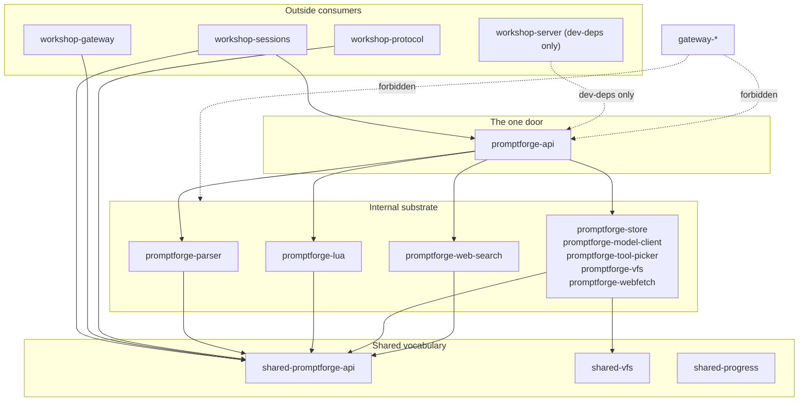

# One-Door promptforge-api

<product-contract>

## Product Requirements

The PromptForge product exposes too many crates to outside consumers. The executor and every type it touches should be reachable through one crate, with shared vocabulary in a shared crate and an enforced boundary that prevents regressions.

- Problem and users:
  - `workshop-sessions` depends directly on seven promptforge substrate crates (`promptforge-core`, `promptforge-core-support`, `promptforge-model-client`, `promptforge-tool-picker`, `promptforge-vfs`, `promptforge-tools`, `promptforge-agent`). `workshop-gateway` depends on `promptforge-core-support` and `promptforge-model-client`. `workshop-protocol` depends on `promptforge-core-support`. `workshop-server` has zero production promptforge deps (only dev-deps for integration tests). Future third-party hosts embedding the PromptForge runtime need a single, stable API surface.
  - The standalone `.lua` agent program path is dead; the unified Markdown prompt runtime replaced it. The code path, discovery logic, guides, and the `promptforge-agent` crate remain as vestigial weight.
  - `product-integration-tests` is a dead crate (one `#[ignore]`d live-inference smoke test, not in CI, never run routinely).
- Goals:
  - Establish `promptforge-api` (renamed from `promptforge-core`) as the only `promptforge-*` crate outside products may depend on.
  - Establish `shared-promptforge-api` (renamed from `promptforge-core-support`, absorbing tool and model vocabulary) as the shared vocabulary crate both promptforge and workshop depend on directly.
  - Remove the `.lua` agent program path entirely: discovery, launch, error types, guides, and the `promptforge-agent` crate. Directory agents become `.md` prompts.
  - Enforce the one-door boundary in the build via the existing `xtask` tidy harness (`cargo test -p xtask`).
- Non-goals:
  - Do not merge internal substrate crates into one binary crate. Internal crate boundaries stay for Cargo-enforced layering and parallel compilation.
  - Do not share types with gateway crates. Gateway deliberately owns its own wire vocabulary and has zero promptforge edges today.
  - Do not implement host-installed tool groups or a global tool namespace (future work).
  - Do not change the executor's runtime behavior, prompt language semantics, or model-loop protocol.
  - Do not change Bashkit integration (future work; Bashkit is a `Tool` whose constructor takes a `VfsRef` clone and an optional command overlay registry).
- Success criteria:
  - `workshop-sessions` depends on exactly `promptforge-api` plus `shared-promptforge-api` and no other `promptforge-*` crate.
  - `workshop-gateway` depends on exactly `shared-promptforge-api` and no other `promptforge-*` crate.
  - `workshop-protocol` depends on `shared-promptforge-api` (a `shared-*` crate, legal for any product).
  - `workshop-server` dev-dependencies reference only `promptforge-api` and `shared-promptforge-api`.
  - `cargo test -p xtask` fails if any crate outside the PromptForge product depends on a `promptforge-*` crate other than `promptforge-api`.
  - No `.lua` agent program code, discovery, error type, or guide content remains outside historical `vibe/` docs.
  - All workspace tests, clippy, and format checks pass.
- Constraints:
  - Keep `promptforge: 0` throughout; never increment it.
  - `shared-promptforge-api` must have zero product-crate dependencies (only third-party and other `shared-*` crates).
  - AGENTS.md bars new topology checks without explicit operator approval. The operator explicitly directed this enforcement.
  - The 500-line file ceiling applies to `xtask/src/tidy.rs` (currently 332 lines); split if the addition would exceed it.
- Open questions:
  - None

## Functional Specification

Outside consumers see two crates: `promptforge-api` for the executor and `shared-promptforge-api` for vocabulary. Directory agents are `.md` prompts discovered under `agents.path`. The build enforces the boundary.

- Actors and workflows:
  - A host embedding PromptForge depends on `promptforge-api` for `run()`, `RunConfig`, `Prompt`, and re-exported parser/client types, and on `shared-promptforge-api` for `Observer`, `CancelHandle`, `Tool`, `ToolCatalog`, model vocabulary, and event/metrics types.
  - Workshop discovers `.md` file stems under `agents.path`. A directory `chat.md` shadows the embedded built-in (same shadowing semantics as the former `.lua` path, new extension). Every directory agent launches through `promptforge_api::run` on the unified Markdown runtime.
  - `RunConfig` defaults the store handle to `promptforge_vfs::empty()` internally; hosts that do not seed the store omit it. `ResolutionContext` accepts an optional tool picker; capability-free agents pass `None`.
- Inputs and outputs:
  - `promptforge-api::run(&Prompt, &str, ResolutionContext, RunConfig)` - the `&vfs` parameter is absorbed into `RunConfig` with a default.
  - `shared-promptforge-api` carries every symbol in the symbol table below. No other public items.
- States and validation:
  - The xtask boundary check validates all dependency kinds (normal, dev, build, target-specific) across every workspace manifest on every `cargo test -p xtask` run.
- Errors and recovery:
  - A session-local `AgentRunError` in `workshop-sessions` replaces `promptforge_agent::AgentError`, mapping `RunErrorKind::Cancelled` to interrupted and all other failures to a message-bearing variant.
- Security and privacy behavior:
  - No change to trust envelopes, untrusted-content guards, or credential handling.
- Acceptance criteria:
  - `cargo metadata --locked` shows no outside-product edge to any `promptforge-*` crate except `promptforge-api`.
  - Directory agent discovery finds `.md` stems only, shadows the built-in via `chat.md`, and rejects unreadable shadows with an error. No `.lua` files are discovered, launched, or mentioned in any error message.
  - The `subscribe_progress` gateway integration in `workshop-gateway` works over the workshop's own gateway client, not through `promptforge-model-client`.

</product-contract>

<implementation-contract>

## Technical Design

Five slices, strictly ordered after the first two (which are independent). Slice 1 removes the `.lua` path. Slice 2 renames `promptforge-core-support` to `shared-promptforge-api` and sinks vocabulary. Slice 3 renames `promptforge-core` to `promptforge-api` and fixes API signatures. Slice 4 migrates consumers. Slice 5 adds xtask enforcement.

- Architecture:

- Modules and interfaces:
  - **Slice 1 - Remove `.lua` agent path:**
    - [crates/workshop-sessions/src/agents.rs](crates/workshop-sessions/src/agents.rs): delete `AgentSource::Lua`; discovery lists `.md` file stems; `chat.md` shadowing replaces `chat.lua` shadowing. Update discovery tests.
    - [crates/workshop-sessions/src/agents/supervisor/effects.rs](crates/workshop-sessions/src/agents/supervisor/effects.rs): delete `launch_lua` and the `AgentSource::Lua` arm. Introduce session-local `AgentRunError` mapping `RunErrorKind::Cancelled` to interrupted. Delete the `promptforge_agent` import.
    - [crates/workshop-sessions/src/agents/supervisor/events.rs](crates/workshop-sessions/src/agents/supervisor/events.rs) and [crates/workshop-sessions/tests/it/chat_gate.rs](crates/workshop-sessions/tests/it/chat_gate.rs): replace `AgentError` with the local error type.
    - [crates/workshop-sessions/src/input/tool.rs](crates/workshop-sessions/src/input/tool.rs): audit `UserInputTool` - if it only served `.lua` agents, delete it; if still wired, replace with core `InputTool`. Fix docs either way.
    - [crates/workshop-sessions/src/config.rs](crates/workshop-sessions/src/config.rs): update doc comments from `.lua` to `.md`.
    - Delete `crates/promptforge-agent/` entirely (src, Cargo.toml, AGENTS.md). Remove from root `Cargo.toml` workspace dependencies.
    - [crates/promptforge/src/lib.rs](crates/promptforge/src/lib.rs): delete the `agent` module and its Cargo dependency.
    - `LuaProgram` stays: it is the compiled-chunk type behind `Block::Lua`, not the standalone runner.
  - **Slice 2 - `promptforge-core-support` becomes `shared-promptforge-api`:**
    - `git mv crates/promptforge-core-support crates/shared-promptforge-api`; rename the package; update every dependent manifest (`promptforge-parser`, `promptforge-lua`, `promptforge-model-client`, `promptforge-core`, `workshop-protocol`, `workshop-gateway`, `workshop-sessions`) and the root `Cargo.toml` workspace entry.
    - Sink only the host-facing model vocabulary from `promptforge-model-client` into a `models` module: `ModelId`, `ModelIdError`, `ModelCatalog`, `ModelCatalogError`, `ModelDescriptor`, `ThinkingMode`. Also move `StreamDelta` (the one wire type hosts name, for the `on_delta` callback). `promptforge-model-client` keeps everything else: transport (`GatewayClient`, `GatewayEndpoint`, `SecretString`, `SecretError`, `fetch_model_catalog`, `subscribe_progress`), binding machinery (`ModelBinding`/`ModelSet`/`ModelView`/`ModelBindOpts`/`ModelInvocation`, `CompletionError`/`CompletionErrorKind`), value types hosts never construct (`Temperature`, `TemperatureError`, `CompletionOptions`), and all wire types (`Message`, `ToolSchema`, `ToolSchemaError`, `ToolCall`, `ToolArguments`, `Completion`, `CompletionResult`).
    - Sink the entire `promptforge-tools` crate as a `tools` module. The crate dissolves: delete `crates/promptforge-tools/` and remove it from the root `Cargo.toml` workspace dependencies. Its dependents (`promptforge-webfetch`, `promptforge-web-search`, `promptforge-lua`, `promptforge-core`) switch to `shared-promptforge-api`. `promptforge-tool-picker`'s private `ToolId` ([crates/promptforge-tool-picker/src/catalog.rs](crates/promptforge-tool-picker/src/catalog.rs) line 38) is a separate type and stays.
    - Add `async-trait` and `serde_json` to `shared-promptforge-api`'s Cargo.toml (required by `Tool` trait and `Tool::call`/`ToolCallEvent::arguments`).
    - Drop the deprecated free function `untrusted::wrap` (deprecated since 0.2.0; `GuardNonce::wrap` is the method).
    - Update doc examples: `use promptforge_tools::...` becomes `use shared_promptforge_api::tools::...`; `use promptforge_model_client::model::...` becomes `use shared_promptforge_api::models::...`; etc.
  - **Slice 3 - `promptforge-core` becomes `promptforge-api`:**
    - `git mv crates/promptforge-core crates/promptforge-api`; rename the package; move integrator-facing metadata from the retiring facade.
    - Delete `crates/promptforge/` (facade, AGENTS.md, README).
    - Root `Cargo.toml`: replace `promptforge-core` and `promptforge` workspace entries with `promptforge-api`.
    - `ResolutionContext` ([crates/promptforge-api/src/execute/gateway.rs](crates/promptforge-api/src/execute/gateway.rs)): make the tool picker optional so capability-free agents pass `None`.
    - `RunConfig` ([crates/promptforge-api/src/execute/config.rs](crates/promptforge-api/src/execute/config.rs)): absorb the store handle as an optional entry defaulting to `promptforge_vfs::empty()`; `run()` drops its `&vfs` parameter.
    - Re-export posture: only two re-export modules survive, both justified by `run()`'s signature orbit. `parser` (`Prompt`, `ParseError`, `Block`, `Section`, ...) because hosts call `Prompt::parse()`. `client` (`GatewayClient`, `GatewayEndpoint`, `SecretString`, `CompletionError`/`CompletionErrorKind`) because hosts pass `GatewayClient` to `RunConfig::client()`. Drop `tools`, `observe`, `model`, `store` re-export modules and root `CancelHandle` re-export - all now in `shared-promptforge-api` or reachable through it. `store` re-exports are dropped because the VFS handle moves into `RunConfig` with a default; hosts that seed/extract the store depend on `shared-vfs` directly (a `shared-*` crate, legal for any product).
    - Mechanical: update `promptforge_core::` self-references in tests, benches, and doc comments.
  - **Slice 4 - Migrate consumers:**
    - [crates/workshop-sessions/Cargo.toml](crates/workshop-sessions/Cargo.toml): collapse the seven promptforge deps to two edges: `promptforge-api` and `shared-promptforge-api`. Rewrite all imports.
    - [crates/workshop-gateway/Cargo.toml](crates/workshop-gateway/Cargo.toml): collapse `promptforge-core-support` and `promptforge-model-client` to one edge: `shared-promptforge-api`. Rewrite imports.
    - [crates/workshop-protocol/Cargo.toml](crates/workshop-protocol/Cargo.toml): rename `promptforge-core-support` dependency to `shared-promptforge-api`; update imports.
    - [crates/workshop-server/Cargo.toml](crates/workshop-server/Cargo.toml): update dev-dependencies to reference only `promptforge-api` and `shared-promptforge-api`.
    - [crates/workshop-sessions/src/gateway_progress.rs](crates/workshop-sessions/src/gateway_progress.rs): reimplement `GET /admin/progress` subscription over the workshop's own gateway client instead of `promptforge_model_client::model::subscribe_progress`.
    - Delete empty-`ToolPicker`, empty-`ToolCatalog`, and `vfs: VfsRef` field construction in `workshop-sessions/src/agents/supervisor/effects.rs` and `workshop-sessions/src/agents.rs`, using the Slice 3 defaults.
    - Delete `crates/product-integration-tests/` entirely and remove it from the root `Cargo.toml` workspace dependencies.
  - **Slice 5 - Enforce boundary:**
    - Rename `crates/xtask/` to `crates/build-xtask/`: rename the directory, update the package name in its Cargo.toml, update the root `Cargo.toml` workspace dependency entry, update the `xtask` alias in `.cargo/config.toml` to point at the renamed crate, and update any CI or doc references.
    - [crates/build-xtask/src/tidy.rs](crates/build-xtask/src/tidy.rs): add `product_boundary_violations` check wired into `all_violations` with a `#[test]` wrapper. If the file would exceed 500 lines, split a `product.rs` module first.
    - Rules encoded across all dependency kinds: no outside crate may depend on `promptforge-*` except `promptforge-api`; codify the full AGENTS.md product-boundary matrix (promptforge/gateway/workshop isolation).
    - Update [crates/promptforge-api/AGENTS.md](crates/promptforge-api/AGENTS.md) and root [AGENTS.md](AGENTS.md) to name the one-door rule.

- File and public API changes:
  - Crates deleted: `promptforge-agent`, `promptforge-tools`, `promptforge` (facade), `product-integration-tests`.
  - Crates renamed: `promptforge-core-support` to `shared-promptforge-api`, `promptforge-core` to `promptforge-api`.
  - `run()` signature loses the `&vfs` parameter (absorbed into `RunConfig` with a default).
  - `ResolutionContext` gains an optional picker path.
  - Guides rewritten: [guide/promptforge-agent-guide.md](guide/promptforge-agent-guide.md), [guide/src/agent/01-agent-programs.md](guide/src/agent/01-agent-programs.md), [crates/workshop-sessions/README.md](crates/workshop-sessions/README.md).

- Data, persistence, failure, security, and privacy constraints:
  - No persistence, protocol, or security changes. Trust envelopes, untrusted-content guards, and credential handling are unchanged.
  - `workshop-sessions`'s event log format is unchanged; the `RuntimeEvent` JSONL schema is stable.

</implementation-contract>

### Complete symbol table for shared-promptforge-api

31 public symbols. This table is the contract: any plan change that alters the crate's contents must update it.

**`cancel` module (1 public symbol):**

| Symbol | Kind | Description |
|---|---|---|
| `CancelHandle` | struct | Create, clone, pass to `RunConfig`, call `.cancel()` to stop a run |

The 5 cancel helpers (`scope`, `maybe_scope`, `current`, `wait_cancelled`, `is_cancelled`) stay in the crate as `#[doc(hidden)]` exports - executor internals consumed only by `promptforge-core`, `promptforge-lua`, and `promptforge-agent`. No workshop crate calls them (verified by exhaustive grep).

**`events` module (9 symbols):**

| Symbol | Kind | Description |
|---|---|---|
| `EventLog` | trait | Read-side run history: append-only, indexed `len`/`get` |
| `RuntimeEvent` | struct | One durable serde record; one JSONL line |
| `RuntimeEventKind` | enum | `AssistantReply`, `AssistantToolCalls`, `ToolResult`, `Thinking`, `UserInput` |
| `ToolCallEvent` | struct | One model-requested tool call: id, name, raw arguments |
| `CallMetrics` | struct | Everything measured about one model call |
| `Usage` | struct | Token accounting |
| `LlamaTimings` | struct | llama.cpp `timings` |
| `VllmMetrics` | struct | vLLM per-request metrics |
| `ClientTiming` | struct | Client-clock timing |

**`observe` module (3 symbols):**

| Symbol | Kind | Description |
|---|---|---|
| `Observation` | enum | Report-only lifecycle vocabulary; `#[non_exhaustive]` |
| `Observer` | trait | Report-only sink with default-body content hooks |
| `NullObserver` | struct | The discarding observer |

`detail` stays as a `#[doc(hidden)]` emit-site seam, not counted.

**`models` module (6 symbols, sunk from promptforge-model-client):**

| Symbol | Kind | Description |
|---|---|---|
| `ModelId` | struct | Stable model identity: server namespace plus name |
| `ModelIdError` | struct | Identity validation failure |
| `ModelCatalog` | struct | Collision-free live model set for one bind pass |
| `ModelCatalogError` | enum | Catalog build failure (`DuplicateId`) |
| `ModelDescriptor` | struct | One catalogued model: id, description, context window, thinking |
| `ThinkingMode` | enum | `Never`/`Always`/`Switchable` |

**`wire` module (1 symbol):**

| Symbol | Kind | Description |
|---|---|---|
| `StreamDelta` | enum | `Text`/`Reasoning` - the `on_delta` callback type |

**`tools` module (11 symbols, sunk from promptforge-tools; the crate dissolves):**

| Symbol | Kind | Description |
|---|---|---|
| `Tool` | trait | The host extension point |
| `ToolCatalog` | struct | Construction-validated tool registry |
| `ToolCatalogError` | enum | Catalog build failure with stable `kind()` |
| `ToolCatalogErrorKind` | enum | Classifier for `ToolCatalogError` |
| `ToolId` | struct | Stable tool identity |
| `ToolIdError` | struct | Identity validation failure with stable `kind()` |
| `ToolIdErrorKind` | enum | Classifier (`Empty`, `Separator`, `Control`) |
| `ToolOutput` | struct | Successful result carrying text and mandatory trust |
| `OutputTrust` | enum | `Trusted`/`Untrusted` |
| `ToolError` | struct | Narrow, model-safe tool failure |
| `ToolErrorKind` | enum | Classifier (`InvalidArguments`, `Backend`, `Transport`, `Cancelled`, `Other`) |

**Deliberately excluded from the shared crate (stays in substrate crates, verified by grep):**

- **Executor internals:** `scope`/`maybe_scope`/`current`/`wait_cancelled`/`is_cancelled` (cancel helpers, doc-hidden), `GuardNonce` (untrusted wrapping, doc-hidden), `detail` (observe emit-site constants, doc-hidden)
- **Binding machinery hosts never construct:** `Temperature`, `TemperatureError`, `CompletionOptions`, `ModelBinding`, `ModelSet`, `ModelView`, `ModelBindOpts`, `ModelInvocation`, `ModelResolver`, `ResolvedModel`, `PickerModelResolver`
- **Wire types only the executor names:** `Message`, `ToolSchema`, `ToolSchemaError`, `ToolCall`, `ToolArguments`, `Completion`, `CompletionResult`
- **Transport:** `GatewayClient`, `GatewayEndpoint`, `SecretString`, `SecretError`, `CompletionError`, `CompletionErrorKind`, `fetch_model_catalog`, `subscribe_progress`

`untrusted` and `cancel` modules stay in the crate physically (they move with the rename) but their internal-only symbols are `#[doc(hidden)]`, not public API.

<verification-contract>

## Testing Plan

The existing test suite covers the executor, workshop-sessions, and xtask. This plan adds the boundary check and verifies nothing regresses.

- Unit:
  - Existing parser, Lua, core, model-client, projection, and input tests continue to pass under the renamed crates.
  - Discovery tests in `workshop-sessions` updated: `.md` stems replace `.lua`, `chat.md` shadowing replaces `chat.lua`, unreadable-shadow tests preserved.
  - New `product_boundary_violations` test in xtask.
- Integration and end-to-end:
  - `cargo nextest run --locked --workspace --exclude workshop --exclude workshop-server --all-features`, then `cargo nextest run --locked -p workshop -p workshop-server`.
  - The `chat_gate` integration tests pass with the local `AgentRunError` replacing `AgentError`.
  - The reimplemented `subscribe_progress` in `gateway_progress.rs` produces the same observable behavior.
- Regression, security, and performance:
  - `cargo fmt --all --check` and `cargo clippy --workspace --exclude workshop --exclude workshop-server --all-targets --all-features -- -D warnings` plus the workshop pair.
  - `cargo metadata --locked` confirms no outside-product edges to `promptforge-*` except `promptforge-api`.
  - Grep sweep: no `promptforge_agent`, `promptforge_core` (underscore form), `promptforge-core` (hyphen form in non-historical files), `product-integration-tests`, or `.lua agent` references outside `vibe/` docs.
  - Doc examples compile: all moved types have updated `use` paths.
- Exit criteria:
  - `cargo test -p build-xtask` green (boundary check).
  - Full workspace test suite green.
  - No `promptforge-tools`, `promptforge-agent`, or `product-integration-tests` crate directory exists.
  - Historical `vibe/` plans are deliberately untouched and excluded from the sweep.

</verification-contract>

<decision-record>

## Decision Record

- Decisions:
  - **One-door API crate.** `promptforge-core` is renamed to `promptforge-api` and becomes the only `promptforge-*` crate outside products may depend on. The implementation moves untouched - no facade, no duplication. The operator directed: "I want the outside world to only see one promptforge crate, not promptforge-*."
  - **Shared vocabulary crate.** `promptforge-core-support` is renamed to `shared-promptforge-api` and absorbs model vocabulary from `promptforge-model-client` and the entire tool contract from `promptforge-tools`. The operator directed: "Tool stuff like Tool, Tools, ToolCatalog, those need to be in shared-promptforge-api" and emphasized tools are the host integration surface, the price of admission.
  - **`.lua` agent programs are dead.** All `.lua` discovery, launch, error types, guides, and the `promptforge-agent` crate are removed. Directory agents are `.md` prompts only - no `.lua` fallback, no compatibility shim, no deprecation period. The operator confirmed: "Yes .lua is dead, everything has to be removed, guides fixed, everything. The user can drop .md files in the agent.path instead" and later reinforced: "there will be no more .lua agents."
  - **Reading 1 for internal crates.** The PromptForge product depends on no other product crates (only `shared-*` and third-party). Internal substrate crates stay as separate crates for Cargo-enforced layering. The operator chose: "Reading 1 is what I want."
  - **Enforce with cargo test.** The boundary is enforced in the existing `xtask` tidy harness, which runs under `cargo test -p xtask`. The operator directed: "I want the structure enforced with cargo."
  - **No re-exports for vocabulary.** Types that are cross-product vocabulary live in `shared-promptforge-api` and consumers name them there directly. Re-exports exist only for types that appear in `promptforge-api`'s own function signatures and still live in internal crates. The operator directed: "I dont want re-exports if they can be avoided."
  - **API signature simplification.** `ResolutionContext` makes the tool picker optional. `RunConfig` absorbs the VFS handle with a default. These changes remove the need for outside consumers to construct empty pickers or name `promptforge-vfs`.
  - **`promptforge-tools` dissolves entirely.** The crate is 100% vocabulary (`ids.rs`, `output.rs`, `registry.rs`); all of it sinks into `shared-promptforge-api::tools`. The crate directory and Cargo entry are deleted.
  - **Delete `product-integration-tests`.** One `#[ignore]`d live-inference smoke test, not in CI, never run routinely. Dead weight.
  - **Only host-facing symbols move to the shared crate.** Exhaustive grep confirmed: wire types (`Message`, `ToolCall`, `ToolSchema`, `Completion`, etc.) are named only by promptforge-internal crates, never by workshop. Cancel helpers (`scope`, `maybe_scope`, `current`, `wait_cancelled`, `is_cancelled`) are the same. `Temperature`/`CompletionOptions` are binding machinery hosts never construct (`ModelDescriptor::new` takes `ThinkingMode`, not `Temperature`). `GuardNonce` is executor-internal. All stay in their substrate crates as `#[doc(hidden)]` or private. Only `StreamDelta` crosses the host boundary (the `on_delta` callback).
  - **Topology check is an approved exception.** AGENTS.md bars new topology checks without explicit operator approval. The operator explicitly directed this enforcement, extending an existing approved facility.
- Rejected alternatives:
  - **Option B (full merge).** Folding all 12 substrate crates into one loses Cargo-enforced internal layering, compile parallelism, and forces `promptforge-tool-picker`'s tensor/FFI build on every consumer. Revisit only if the convention proves leaky.
  - **`shared-promptforge` as the crate name.** The operator consistently used `shared-promptforge-api`; the shorter name was dropped.
  - **Putting the execution API in `shared-promptforge`.** Violates the `shared-*` rule ("must not depend on any product crates") because the executor depends on parser, Lua, model-client, store, and tools.
  - **Re-export modules for events/observe/cancel/tools.** The operator directed avoiding re-exports; sinking vocabulary to the shared crate is the strategy.
- Assumptions, risks, and notes:
  - `promptforge-tool-picker`'s private `ToolId` in `catalog.rs` is a distinct type from the contract `ToolId` and stays in the picker.
  - `workshop-sessions`'s `subscribe_progress` rewrite (Slice 4) is the highest-risk item: it reimplements a gateway SSE subscription over a different HTTP client. Observable behavior must be identical.
  - `CompletionError`/`CompletionErrorKind` stay in `promptforge-model-client` because they wrap its internal transport error enum; they reach consumers through the `promptforge-api::client` re-export.
  - `shared-promptforge-api` needs `async-trait` (for `Tool`) and `serde_json` (for `Tool::call` signature and `ToolCallEvent::arguments`) added as Cargo dependencies.
  - Historical `vibe/` plans reference old crate names and are deliberately left untouched.

</decision-record>

<project-survey>

## Project Survey

- Status: complete
- Build command: `cargo build` (default member is `gateway`; desktop app: `cargo build -p workshop`).
- Full test: `cargo nextest run --locked --workspace --exclude workshop --exclude workshop-server --all-features`, then `cargo nextest run --locked -p workshop -p workshop-server`.
- Focused test command pattern: `cargo nextest run --locked -p <crate> [<test-name-filter>]` for the step's primary crate (add `--all-features` when the crate has features).
- Component test command pattern: `cargo nextest run --locked -p <crate-a> [-p <crate-b> ...]` covering every crate the component touches.
- Clippy: `cargo clippy --workspace --exclude workshop --exclude workshop-server --all-targets --all-features -- -D warnings` (workshop: `cargo clippy -p workshop -p workshop-server --all-targets -- -D warnings`).
- Format: `cargo fmt --all --check`.
- Boundary check: `cargo test -p build-xtask` (also `cargo xtask tidy` via the `.cargo/config.toml` alias).
- Existing xtask tidy harness: [crates/build-xtask/src/tidy.rs](crates/build-xtask/src/tidy.rs) (332 lines) enforces workshop tier dependencies, file ceiling, and lint inheritance. Tier constants: VOCABULARY = workshop-protocol, workshop-registry, workshop-support; SERVICES = workshop-gateway, workshop-menu, workshop-status; FEATURES = workshop-sessions, workshop-workspace; SHELL = workshop-server.
- Post-decomposition workshop crate map (verified 2026-09-12): `workshop-sessions` has 7 promptforge edges (core, core-support, model-client, tool-picker, vfs, tools, agent). `workshop-gateway` has 2 (core-support, model-client). `workshop-protocol` has 1 (core-support). `workshop-server` has 0 production deps (7 dev-deps for integration tests). `workshop`, `workshop-menu`, `workshop-registry`, `workshop-status`, `workshop-support`, `workshop-workspace` have 0.
- Session runtime location: `crates/workshop-sessions/src/agents/` (formerly `workshop-server/src/session_agents/`). Embedded chat: `crates/workshop-sessions/agents/chat.md`. `AgentSource` in `crates/workshop-sessions/src/agents/session.rs`.
- Gateway crate survey (verified 2026-09-12): all 12 gateway-family crates have zero promptforge edges. Gateway deliberately keeps opaque JSON wire types per [crates/gateway-protocol/src/wire.rs](crates/gateway-protocol/src/wire.rs) line 1.
- Duplicate vocabulary inventory: `ThinkingMode` is variant-for-variant identical in `gateway-config` and `promptforge-model-client`. Gateway `ModelInfo`/`Model`/`ModelConfig` are richer supersets of `ModelDescriptor`. Gateway passes usage/timings as opaque JSON; promptforge has typed `Usage`/`LlamaTimings`/`VllmMetrics`/`ClientTiming`. Gateway's private `ParsedCall` mirrors `ToolCall`.

</project-survey>

<execution-plan>

## Execution Instructions

Component order and placement reasons:

1. `lua-path-removal` - pure deletion inside `workshop-sessions` plus the `promptforge-agent` crate; depends on nothing and unblocks consumer migration.
2. `shared-vocabulary` - independent of `lua-path-removal` (the two may be built jointly); placed second because `api-crate` cannot drop its re-export modules until the types live in the shared crate.
3. `api-crate` - depends on `shared-vocabulary`.
4. `consumer-migration` - depends on `lua-path-removal` (agent crate gone) and `api-crate` (renames and new signatures done).
5. `boundary-enforcement` - depends on `consumer-migration`; the check would fail on the old edges.
6. `verification` - depends on `boundary-enforcement`; runs last.

Pieces within each component are sequential: each step's commit must compile and pass its tests against the previous step's tree.

<step-1>

### Step 1: Remove .lua discovery and launch from workshop-sessions [completed]

- Component: lua-path-removal
- Piece: sessions-lua-removal (sequential: variant removal, arm removal, and error type must compile in one commit)
- [crates/workshop-sessions/src/agents.rs](crates/workshop-sessions/src/agents.rs): delete `AgentSource::Lua`; discovery lists `.md` file stems only; `chat.md` shadowing replaces `chat.lua` shadowing; unreadable-shadow rejection preserved.
- [crates/workshop-sessions/src/agents/supervisor/effects.rs](crates/workshop-sessions/src/agents/supervisor/effects.rs): delete `launch_lua` and the `AgentSource::Lua` arm; delete the `promptforge_agent` import; introduce session-local `AgentRunError` mapping `RunErrorKind::Cancelled` to interrupted and all other failures to a message-bearing variant.
- [crates/workshop-sessions/src/agents/supervisor/events.rs](crates/workshop-sessions/src/agents/supervisor/events.rs) and [crates/workshop-sessions/tests/it/chat_gate.rs](crates/workshop-sessions/tests/it/chat_gate.rs): replace `AgentError` with `AgentRunError`.
- [crates/workshop-sessions/src/config.rs](crates/workshop-sessions/src/config.rs): update doc comments from `.lua` to `.md`.
- Tests in the same commit: updated discovery tests (`.md` stems, `chat.md` shadowing, unreadable shadow) and the `chat_gate` integration tests against `AgentRunError`.

</step-1>

<step-2>

### Step 2: Audit UserInputTool [completed]

- Component: lua-path-removal
- Piece: sessions-lua-removal
- [crates/workshop-sessions/src/input/tool.rs](crates/workshop-sessions/src/input/tool.rs): if `UserInputTool` only served `.lua` agents, delete it; if still wired, replace with the core `InputTool`. Fix docs either way.
- Tests in the same commit: input tool unit tests updated or deleted with the tool.

</step-2>

<step-3>

### Step 3: Delete the promptforge-agent crate [completed]

- Component: lua-path-removal
- Piece: agent-crate-deletion
- Delete `crates/promptforge-agent/` entirely (src, Cargo.toml, AGENTS.md); remove its entry from the root `Cargo.toml` workspace dependencies.
- [crates/promptforge/src/lib.rs](crates/promptforge/src/lib.rs): delete the `agent` module; remove the dependency from [crates/promptforge/Cargo.toml](crates/promptforge/Cargo.toml).
- `LuaProgram` stays: it is the compiled-chunk type behind `Block::Lua`, not the standalone runner.
- Tests in the same commit: workspace builds; grep confirms no `promptforge_agent` references outside `vibe/`.

</step-3>

<step-4>

### Step 4: Rewrite agent guides for .md directory agents [completed]

- Component: lua-path-removal
- Piece: guide-rewrite
- Rewrite [guide/promptforge-agent-guide.md](guide/promptforge-agent-guide.md), [guide/src/agent/01-agent-programs.md](guide/src/agent/01-agent-programs.md), and [crates/workshop-sessions/README.md](crates/workshop-sessions/README.md): directory agents are `.md` prompts discovered under `agents.path`; `chat.md` shadows the embedded built-in; no `.lua` mention outside historical `vibe/` docs.
- Tests in the same commit: guide build and any doc-link checks pass.

</step-4>

<step-5>

### Step 5: Rename promptforge-core-support to shared-promptforge-api [completed]

- Component: shared-vocabulary
- Piece: crate-rename
- `git mv crates/promptforge-core-support crates/shared-promptforge-api`; rename the package; update every dependent manifest (`promptforge-parser`, `promptforge-lua`, `promptforge-model-client`, `promptforge-core`, `workshop-protocol`, `workshop-gateway`, `workshop-sessions`) and the root `Cargo.toml` workspace entry.
- Constraint: `shared-promptforge-api` keeps zero product-crate dependencies.
- Tests in the same commit: full workspace build and the renamed crate's existing unit tests pass under the new name.

</step-5>

<step-6>

### Step 6: Sink model vocabulary into shared-promptforge-api [completed]

- Component: shared-vocabulary
- Piece: model-sink (sequential after crate-rename: the destination crate must exist under its new name)
- Move from `promptforge-model-client` into a `models` module: `ModelId`, `ModelIdError`, `ModelCatalog`, `ModelCatalogError`, `ModelDescriptor`, `ThinkingMode`. Move `StreamDelta` into a `wire` module.
- `promptforge-model-client` keeps transport (`GatewayClient`, `GatewayEndpoint`, `SecretString`, `SecretError`, `fetch_model_catalog`, `subscribe_progress`), binding machinery (`ModelBinding`/`ModelSet`/`ModelView`/`ModelBindOpts`/`ModelInvocation`, `CompletionError`/`CompletionErrorKind`), value types (`Temperature`, `TemperatureError`, `CompletionOptions`), and all wire types (`Message`, `ToolSchema`, `ToolSchemaError`, `ToolCall`, `ToolArguments`, `Completion`, `CompletionResult`); it imports the sunk symbols from `shared-promptforge-api`.
- Update doc examples: `use promptforge_model_client::model::...` becomes `use shared_promptforge_api::models::...`.
- Tests in the same commit: model-client unit tests pass against the shared types; doc examples compile.

</step-6>

<step-7>

### Step 7: Dissolve promptforge-tools into shared-promptforge-api [completed]

- Component: shared-vocabulary
- Piece: tools-sink (sequential after crate-rename)
- Move the entire crate (`ids.rs`, `output.rs`, `registry.rs`) into a `tools` module: `Tool`, `ToolCatalog`, `ToolCatalogError`, `ToolCatalogErrorKind`, `ToolId`, `ToolIdError`, `ToolIdErrorKind`, `ToolOutput`, `OutputTrust`, `ToolError`, `ToolErrorKind`.
- Delete `crates/promptforge-tools/` and its root `Cargo.toml` entry; switch dependents `promptforge-webfetch`, `promptforge-web-search`, `promptforge-lua`, `promptforge-core` to `shared-promptforge-api`.
- Add `async-trait` and `serde_json` to `shared-promptforge-api`'s Cargo.toml. Drop the deprecated free function `untrusted::wrap`.
- `promptforge-tool-picker`'s private `ToolId` ([crates/promptforge-tool-picker/src/catalog.rs](crates/promptforge-tool-picker/src/catalog.rs) line 38) stays.
- Update doc examples: `use promptforge_tools::...` becomes `use shared_promptforge_api::tools::...`.
- Tests in the same commit: the moved tool unit tests pass in their new home; dependent crate tests pass; doc examples compile.

</step-7>

<step-8>

### Step 8: Rename promptforge-core to promptforge-api and delete the facade [completed]

- Component: api-crate
- Piece: crate-rename
- `git mv crates/promptforge-core crates/promptforge-api`; rename the package; move integrator-facing metadata from the retiring facade.
- Delete `crates/promptforge/` (facade, AGENTS.md, README). Root `Cargo.toml`: replace the `promptforge-core` and `promptforge` workspace entries with `promptforge-api`.
- Mechanical: update `promptforge_core::` self-references in tests, benches, and doc comments.
- Tests in the same commit: the executor test suite passes under the new crate name.

</step-8>

<step-9>

### Step 9: Simplify the run API and re-export posture [completed]

- Component: api-crate
- Piece: api-signatures (sequential after crate-rename: edits land on the renamed crate)
- `ResolutionContext` ([crates/promptforge-api/src/execute/gateway.rs](crates/promptforge-api/src/execute/gateway.rs)): make the tool picker optional so capability-free agents pass `None`.
- `RunConfig` ([crates/promptforge-api/src/execute/config.rs](crates/promptforge-api/src/execute/config.rs)): absorb the store handle as an optional entry defaulting to `promptforge_vfs::empty()`; `run()` drops its `&vfs` parameter, becoming `run(&Prompt, &str, ResolutionContext, RunConfig)`.
- Re-exports: keep only `parser` (`Prompt`, `ParseError`, `Block`, `Section`, ...) and `client` (`GatewayClient`, `GatewayEndpoint`, `SecretString`, `CompletionError`/`CompletionErrorKind`); drop the `tools`, `observe`, `model`, `store` re-export modules and the root `CancelHandle` re-export.
- Tests in the same commit: executor API tests migrated to the new `run()` signature and optional picker.

</step-9>

<step-10>

### Step 10: Reimplement gateway progress subscription [completed]

- Component: consumer-migration
- Piece: progress-reimplementation (isolated: highest-risk item, reimplements a gateway SSE subscription over a different HTTP client; pulled ahead of the edge collapse because workshop-gateway cannot drop its `promptforge-model-client` edge until this lands)
- [crates/workshop-gateway/src/gateway_progress.rs](crates/workshop-gateway/src/gateway_progress.rs): reimplement the `GET /admin/progress` subscription over the workshop's own gateway client instead of `promptforge_model_client::model::subscribe_progress`. Observable behavior must be identical. (The plan's original `workshop-sessions` path was stale; the file lives in `workshop-gateway`.)
- Note: the workshop-protocol migration this component also owns already landed in Steps 5-7 (manifest renamed to `shared-promptforge-api`, imports rewritten); confirm it here.
- Tests in the same commit: gateway progress integration tests produce the same event stream as before; workshop-protocol unit tests pass.

</step-10>

<step-11>

### Step 11: Migrate workshop-gateway and workshop-protocol edges

- Component: consumer-migration
- Piece: small-consumers (sequential after progress-reimplementation: dropping the model-client edge requires the new progress path)
- Move agent `GatewayClient` construction out of [crates/workshop-gateway/src/gateway_binding.rs](crates/workshop-gateway/src/gateway_binding.rs) into `workshop-sessions` ([crates/workshop-sessions/src/agents.rs](crates/workshop-sessions/src/agents.rs) and [crates/workshop-sessions/src/agents/supervisor/effects.rs](crates/workshop-sessions/src/agents/supervisor/effects.rs)), building it from the snapshot's base URL and API key via the `promptforge-api::client` re-exports (`GatewayClient`, `GatewayEndpoint`, `SecretString`).
- [crates/workshop-gateway/Cargo.toml](crates/workshop-gateway/Cargo.toml): drop the `promptforge-model-client` edge, leaving exactly one edge, `shared-promptforge-api`; rewrite imports.
- [crates/workshop-protocol/Cargo.toml](crates/workshop-protocol/Cargo.toml): confirm the single `shared-promptforge-api` edge (landed in Step 5).
- Tests in the same commit: workshop-gateway, workshop-protocol, and workshop-sessions unit tests pass.

</step-11>

<step-12>

### Step 12: Migrate workshop-sessions and workshop-server edges

- Component: consumer-migration
- Piece: sessions-migration (sequential after the gateway edge collapse: the crate's imports change once, after its client construction is settled)
- [crates/workshop-sessions/Cargo.toml](crates/workshop-sessions/Cargo.toml): collapse the remaining promptforge deps to two edges, `promptforge-api` and `shared-promptforge-api`; rewrite all imports.
- Delete empty-`ToolPicker`, empty-`ToolCatalog`, and `vfs: VfsRef` field construction in [crates/workshop-sessions/src/agents/supervisor/effects.rs](crates/workshop-sessions/src/agents/supervisor/effects.rs) and [crates/workshop-sessions/src/agents.rs](crates/workshop-sessions/src/agents.rs), using the Step 9 defaults.
- [crates/workshop-server/Cargo.toml](crates/workshop-server/Cargo.toml): dev-dependencies reference only `promptforge-api` and `shared-promptforge-api`.
- Tests in the same commit: the workshop-sessions suite and workshop-server integration tests pass.

</step-12>

<step-13>

### Step 13: Delete product-integration-tests

- Component: consumer-migration
- Piece: dead-crate-deletion
- Delete `crates/product-integration-tests/` entirely and remove it from the root `Cargo.toml` workspace dependencies.
- Tests in the same commit: `cargo metadata --locked` no longer lists the crate; the workspace builds.

</step-13>

<step-14>

### Step 14: Rename xtask to build-xtask

- Component: boundary-enforcement
- Piece: xtask-rename
- Rename `crates/xtask/` to `crates/build-xtask/`: rename the directory, update the package name in its Cargo.toml, update the root `Cargo.toml` workspace dependency entry, update the `xtask` alias in `.cargo/config.toml`, and update any CI or doc references.
- Tests in the same commit: `cargo test -p build-xtask` and the `cargo xtask tidy` alias both work.

</step-14>

<step-15>

### Step 15: Add the product-boundary check

- Component: boundary-enforcement
- Piece: boundary-check (sequential after xtask-rename: the check lands on the renamed crate)
- [crates/build-xtask/src/tidy.rs](crates/build-xtask/src/tidy.rs): add `product_boundary_violations` wired into `all_violations` with a `#[test]` wrapper. The file is currently 332 lines; if the addition would exceed the 500-line ceiling, split a `product.rs` module first.
- Rules encoded across all dependency kinds (normal, dev, build, target-specific) on every workspace manifest: no outside crate may depend on `promptforge-*` except `promptforge-api`; codify the full AGENTS.md product-boundary matrix (promptforge/gateway/workshop isolation).
- Update [crates/promptforge-api/AGENTS.md](crates/promptforge-api/AGENTS.md) and root [AGENTS.md](AGENTS.md) to name the one-door rule.
- Tests in the same commit: the new boundary test passes on the migrated workspace and fails on an injected violation.

</step-15>

<step-16>

### Step 16: Run full verification and metadata sweep

- Component: verification
- Piece: final-sweep
- `cargo nextest run --locked --workspace --exclude workshop --exclude workshop-server --all-features`, then `cargo nextest run --locked -p workshop -p workshop-server`.
- `cargo clippy --workspace --exclude workshop --exclude workshop-server --all-targets --all-features -- -D warnings`, plus `cargo clippy -p workshop -p workshop-server --all-targets -- -D warnings`; `cargo fmt --all --check`.
- `cargo metadata --locked` confirms no outside-product edge to any `promptforge-*` crate except `promptforge-api`.
- Grep sweep: no `promptforge_agent`, `promptforge_core`, `promptforge-core` (non-historical), `product-integration-tests`, or `.lua agent` references outside `vibe/` docs. Historical `vibe/` plans are deliberately untouched.
- Confirm no `promptforge-tools`, `promptforge-agent`, or `product-integration-tests` crate directory exists; all doc examples compile.
- Tests in this commit: the full suite is the verification; only sweep-fixups are committed.

</step-16>
- Deferred and out of scope:
  - **ThinkingMode ownership.** Two identical enums exist: `gateway_config::ThinkingMode` and the copy in `shared-promptforge-api::models`. Gateway does not depend on the shared copy and must not. If gateway ever wants the shared type, the correct home is a new `shared-gateway-api` crate. Until then, both sides keep their own copy. Doc comment on the shared copy notes: "Deserialized from the gateway's `/v1/models` catalog. If gateway adopts the shared type, move to `shared-gateway-api`."
  - **Gateway-normalized inference metrics.** `LlamaTimings` and `VllmMetrics` are backend-specific types that leak through the gateway into the executor, violating the gateway's purpose of normalizing the provider interface. The correct design: the gateway parses backend-specific timing extensions itself (`"timings"` from llama.cpp, `"metrics"` from vLLM), normalizes them into one `InferenceMetrics` struct (TTFT, e2e, mean ITL, tokens/sec, plus `Usage`), and emits that in a standard response field. `LlamaTimings` and `VllmMetrics` move to gateway-internal crates; the normalized struct lives in `shared-gateway-api`. This is a gateway behavior change, not a crate-boundary change, so it is deferred. For now, `LlamaTimings`, `VllmMetrics`, and `ClientTiming` stay in `shared-promptforge-api::events` as fields of `CallMetrics` because they're working, workshop reads them, and the JSONL event log schema includes them. When the gateway normalization lands, `shared-gateway-api` carries the normalized metrics struct and `CallMetrics` collapses to `Usage` plus `InferenceMetrics`.
  - **Host-installed tool groups** and a global tool namespace extend `shared-promptforge-api::tools` when they land.
  - **Gateway wire-type convergence** is not forced by this plan; `shared-promptforge-api` creates the option without requiring it.
  - **ResolutionContext elimination.** After this plan makes the picker optional and moves `ModelCatalog`/`ToolCatalog` to the shared crate, the struct adds nothing over putting its fields into `RunConfig`. A future simplification folds it into `RunConfig`, giving `run(prompt, args, config)` as the minimal call. Not in this plan because it's a separate signature change with its own test migration.
  - **Bashkit shell integration.** Bashkit will be a `Tool` whose constructor takes a `VfsRef` clone and an optional command overlay registry (for customizing `ls` over virtual mounts). The `Tool` trait is the right abstraction - the configurability lives in `BashkitTool`'s builder, outside the promptforge API boundary. Impact on `run()` or `RunConfig`: none.

</execution-plan>
